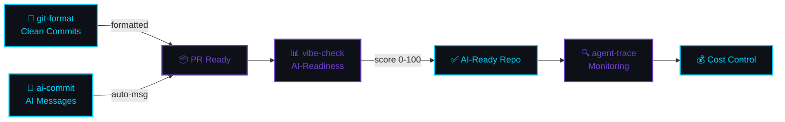

[English](README.md) | [中文](README.zh.md) | [日本語](README.ja.md) | [Français](README.fr.md) | [Español](README.es.md) | [العربية](README.ar.md) | [한국어](README.ko.md) | [Português](README.pt.md) | [Русский](README.ru.md) | [Deutsch](README.de.md)

<!-- ═══════════════════════════════════════════════════════════════════════════════ -->
<!-- ██  HEADER: Deep Space Terminal  ██ -->
<!-- ═══════════════════════════════════════════════════════════════════════════════ -->


<div align="center">

<!-- Terminal-style name -->
```
 ███████╗██╗  ██╗███████╗███╗   ██╗ ██████╗ ████████╗ █████╗  ██████╗ 
 ╚══██╔╝██║  ██║██╔════╝████╗  ██║██╔═══██╗╚══██╔══╝██╔══██╗██╔═══██╗
    ██║ ███████║█████╗  ██╔██╗ ██║██║   ██║   ██║   ███████║██║   ██║
    ██║ ██╔══██║██╔══╝  ██║╚██╗██║██║   ██║   ██║   ██╔══██║██║   ██║
    ██║ ██║  ██║███████╗██║ ╚████║╚██████╔╝   ██║   ██║  ██║╚██████╔╝
    ╚═╝ ╚═╝  ╚═╝╚══════╝╚═╝  ╚═══╝ ╚═════╝    ╚═╝   ╚═╝  ╚═╝ ╚═════╝
```

<!-- Animated typing effect -->


<br/>

<!-- Badges row 1: npm downloads -->
<a href="https://www.npmjs.com/package/git-format"></a>
<a href="https://www.npmjs.com/package/ai-commit"></a>
<a href="https://www.npmjs.com/package/agent-trace"></a>
<a href="https://www.npmjs.com/package/vibe-check"></a>

<!-- Badges row 2: profile stats -->
<a href="https://github.com/liangzhengtao"></a>

<a href="https://github.com/liangzhengtao?tab=repositories"></a>

</div>

---

<!-- ═══════════════════════════════════════════════════════════════════════════════ -->
<!-- ██  QUICK TRY: Terminal Demo  ██ -->
<!-- ═══════════════════════════════════════════════════════════════════════════════ -->

<div align="center">

```
┌──────────────────────────────────────────────────────────────────────┐
│  $ npx git-format                                                    │
│  ✓ feat(auth): إضافة التحقق من تسجيل الدخول                         │
│                                                                      │
│  $ npx ai-commit                                                     │
│  ✓ fix(api): معالجة استجابة فارغة في نقطة نهاية المستخدم             │
│                                                                      │
│  $ npx @liangzhengtao/vibe-check                                     │
│  ┌────────────────────────────────────────────────────────────────┐  │
│  │ ✨ Score: 83/100 │ Grade: A                                    │  │
│  │ ممتاز! مشروعك متوافق جداً مع الذكاء الاصطناعي.                │  │
│  └────────────────────────────────────────────────────────────────┘  │
│                                                                      │
│  $ npx agent-trace                                                   │
│  📊 Sessions: 64 │ Cost: $4681 │ Tokens: 2.3B                       │
│                                                                      │
│  لا حاجة لاستنساخ · لا حاجة لمفتاح API · لا حاجة لإعداد · فقط قم بالتشغيل │
└──────────────────────────────────────────────────────────────────────┘
```

</div>

---

<!-- ═══════════════════════════════════════════════════════════════════════════════ -->
<!-- ██  WHAT I BUILD  ██ -->
<!-- ═══════════════════════════════════════════════════════════════════════════════ -->

<div align="center">

### `>_` ما أبنيه

</div>

<table>
<tr>
<td width="50%" valign="top">

#### 🔧 أدوات CLI الأصلية

| الأداة | الأمر |
|:-----|:--------|
| **[git-format](https://github.com/liangzhengtao/git-format)** — Conventional Commits | `npx git-format` |
| **[ai-commit](https://github.com/liangzhengtao/ai-commit)** — رسائل ارتباط بالذكاء الاصطناعي | `npx ai-commit` |
| **[agent-trace](https://github.com/liangzhengtao/agent-trace)** — مراقبة الوكلاء | `npx agent-trace` |
| **[vibe-check](https://github.com/liangzhengtao/vibe-check)** — تدقيق جاهزية الذكاء الاصطناعي | `npx @liangzhengtao/vibe-check` |

</td>
<td width="50%" valign="top">

#### 📦 مجموعات منسقة

| المجموعة | أبرز المميزات |
|:-----------|:-----------|
| **[awesome-ai-rules](https://github.com/liangzhengtao/awesome-ai-rules)** | 20 قاعدة برمجة AI للإنتاج |
| **[awesome-mcp-servers](https://github.com/liangzhengtao/awesome-mcp-servers)** | 9 إعدادات MCP مُتحقق منها |
| **[awesome-prompts](https://github.com/liangzhengtao/awesome-prompts)** | أكثر من 285 موجه AI |

</td>
</tr>
</table>

---

<!-- ═══════════════════════════════════════════════════════════════════════════════ -->
<!-- ██  ANALYTICS  ██ -->
<!-- ═══════════════════════════════════════════════════════════════════════════════ -->

<div align="center">

### `>_` التحليلات


<br/>


</div>

---

<!-- ═══════════════════════════════════════════════════════════════════════════════ -->
<!-- ██  TECH STACK  ██ -->
<!-- ═══════════════════════════════════════════════════════════════════════════════ -->

<div align="center">

### `>_` الحزمة التقنية

<!-- Languages -->


<!-- AI/ML -->


<!-- Frontend -->


<!-- Backend -->


<!-- DevOps -->


<!-- Tools -->


</div>

---

<!-- ═══════════════════════════════════════════════════════════════════════════════ -->
<!-- ██  WORKFLOW  ██ -->
<!-- ═══════════════════════════════════════════════════════════════════════════════ -->

<div align="center">

### `>_` سير العمل

</div>



---

<!-- ═══════════════════════════════════════════════════════════════════════════════ -->
<!-- ██  ALL PROJECTS  ██ -->
<!-- ═══════════════════════════════════════════════════════════════════════════════ -->

<div align="center">

### `>_` جميع المشاريع `33`

</div>

<details>
<summary><b> أدوات تطوير AI (6)</b></summary>
<br>

| المشروع | الوصف |
|:--------|:------------|
| [agent-trace](https://github.com/liangzhengtao/agent-trace) | تتبع وكيل AI — التكلفة والرموز وصحة الأدوات |
| [awesome-ai-rules](https://github.com/liangzhengtao/awesome-ai-rules) | 20 قاعدة برمجة AI للإنتاج |
| [vibe-check](https://github.com/liangzhengtao/vibe-check) | قياس جاهزية المشروع للذكاء الاصطناعي (0-100) |
| [commit-ai](https://github.com/liangzhengtao/ai-commit) | AI يكتب رسائل الارتباط |
| [awesome-mcp-servers](https://github.com/liangzhengtao/awesome-mcp-servers) | 9 خوادم MCP مُتحقق منها |
| [awesome-ai-agents](https://github.com/liangzhengtao/awesome-ai-agents) | 12 مهارة وكيل AI للإنتاج |

</details>

<details>
<summary><b> البحث والمسيرة المهنية (7)</b></summary>
<br>

| المشروع | الوصف |
|:--------|:------------|
| [awesome-skills](https://github.com/liangzhengtao/awesome-skills) | 12 مهارة بحثية (LaTeX، الإحصاء) |
| [awesome-research-figures](https://github.com/liangzhengtao/awesome-research-figures) | رسومات علمية بجودة النشر |
| [awesome-interview-skills](https://github.com/liangzhengtao/awesome-interview-skills) | 14 مهارة للحصول على وظيفة أحلامك |
| [system-design-interview](https://github.com/liangzhengtao/system-design-interview) | التصميم باستخدام مخططات ASCII |
| [awesome-developer-roadmap](https://github.com/liangzhengtao/awesome-developer-roadmap) | 10 خرائط طريق مهنية (مبتدئ → خبير) |
| [build-your-own-x-cn](https://github.com/liangzhengtao/build-your-own-x-cn) | بناء التقنيات من الصفر (10 دروس تعليمية) |
| [leetcode-patterns-cn](https://github.com/liangzhengtao/leetcode-patterns-cn) | 8 أنماط خوارزميات، 72 مسألة |

</details>

<details>
<summary><b> الفيديو والإبداع (7)</b></summary>
<br>

| المشروع | الوصف |
|:--------|:------------|
| [awesome-video-prompts](https://github.com/liangzhengtao/awesome-video-prompts) | أكثر من 200 موجه (Sora، Runway، Kling) |
| [awesome-video-to-text](https://github.com/liangzhengtao/awesome-video-to-text) | 12 مهارة نسخ نصي |
| [awesome-video-creation](https://github.com/liangzhengtao/awesome-video-creation) | 14 مهارة سير عمل فيديو |
| [awesome-video-skills](https://github.com/liangzhengtao/awesome-video-skills) | 10 مهارات تحرير فيديو |
| [awesome-creative-skills](https://github.com/liangzhengtao/awesome-creative-skills) | 10 مهارات إبداعية (ملصقات، شعارات) |
| [awesome-writing-skills](https://github.com/liangzhengtao/awesome-writing-skills) | 12 مهارة كتابة (مدونة، SEO) |
| [awesome-prompts](https://github.com/liangzhengtao/awesome-prompts) | أكثر من 285 موجه AI لكل مهمة |

</details>

<details>
<summary><b> موارد المطورين (8)</b></summary>
<br>

| المشروع | الوصف |
|:--------|:------------|
| [awesome-dev-tools](https://github.com/liangzhengtao/awesome-dev-tools) | أكثر من 50 أداة مطور مصنفة |
| [awesome-devops-skills](https://github.com/liangzhengtao/awesome-devops-skills) | 12 مهارة DevOps (CI/CD، K8s) |
| [awesome-security-skills](https://github.com/liangzhengtao/awesome-security-skills) | 12 مهارة أمن سيبراني |
| [awesome-startup-skills](https://github.com/liangzhengtao/awesome-startup-skills) | 12 مهارة لرواد الأعمال |
| [ai-agent-architectures](https://github.com/liangzhengtao/ai-agent-architectures) | 7 أنماط وكلاء AI |
| [open-source-llm-guide](https://github.com/liangzhengtao/open-source-llm-guide) | تشغيل نماذج LLM على أجهزتك الخاصة |
| [github-stars-analysis](https://github.com/liangzhengtao/github-stars-analysis) | تحليل اتجاهات نجوم GitHub |
| [awesome-chinese-developer-tools](https://github.com/liangzhengtao/awesome-chinese-developer-tools) | أدوات المطورين الصينية |

</details>

<details>
<summary><b> شخصي (4)</b></summary>
<br>

| المشروع | الوصف |
|:--------|:------------|
| [my-dotfiles](https://github.com/liangzhengtao/my-dotfiles) | بيئة التطوير (Zsh، Git، Neovim) |
| [guizhou-exam-papers](https://github.com/liangzhengtao/guizhou-exam-papers) | امتحانات قويتشو (مجاناً للطلاب) |
| [blog](https://github.com/liangzhengtao/blog) | مقالات تقنية في المدونة |
| [git-format](https://github.com/liangzhengtao/git-format) | تنسيق الارتباطات إلى Conventional Commits |

</details>

---

<!-- ═══════════════════════════════════════════════════════════════════════════════ -->
<!-- ██  FOOTER  ██ -->
<!-- ═══════════════════════════════════════════════════════════════════════════════ -->

<div align="center">

### `>_` التواصل

[](https://github.com/liangzhengtao)
[](https://github.com/liangzhengtao/blog)

<br/>

**33 مشروع · جميعها مفتوحة المصدر · جميعها مجانية**

*إذا وفّر لك أيٌّ منها وقتاً، ضع ⭐ للمستودع الأكثر استخداماً.*

<br/>


</div>
