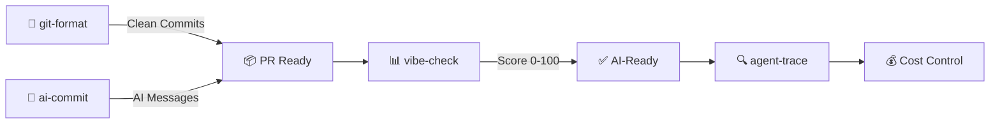

[English](README.md) | [中文](README.zh.md) | [日本語](README.ja.md) | [Français](README.fr.md) | [Español](README.es.md) | [العربية](README.ar.md) | [한국어](README.ko.md) | [Português](README.pt.md) | [Русский](README.ru.md) | [Deutsch](README.de.md)

<!-- ═══════════════════════════════════════════════════════════════ -->
<!-- HEADER: Animated Terminal                                       -->
<!-- ═══════════════════════════════════════════════════════════════ -->

<div align="center">


</div>


<br/>

<!-- ═══════════════════════════════════════════════════════════════ -->
<!-- BADGES: npm downloads + profile stats                           -->
<!-- ═══════════════════════════════════════════════════════════════ -->

<a href="https://www.npmjs.com/package/git-format"></a>
<a href="https://www.npmjs.com/package/ai-commit"></a>
<a href="https://www.npmjs.com/package/agent-trace"></a>
<a href="https://www.npmjs.com/package/vibe-check"></a>

<br/>

<a href="https://github.com/liangzhengtao"></a>

<a href="https://github.com/liangzhengtao?tab=repositories"></a>

</div>

---

<!-- ═══════════════════════════════════════════════════════════════ -->
<!-- ABOUT ME                                                        -->
<!-- ═══════════════════════════════════════════════════════════════ -->

## 👋 عني

أنا مطور متخصص في بناء أدوات CLI مدعومة بالذكاء الاصطناعي. تساعد أدواتي المطورين في:
- **سير عمل Git** — تنسيق تلقائي للالتزامات، رسائل مولدة بالذكاء الاصطناعي
- **مراقبة وكلاء الذكاء الاصطناعي** — تتبع التكاليف، الرموز، صحة الأدوات
- **تدقيق المشاريع** — تقييم جاهزية قاعدة الكود للذكاء الاصطناعي

جميع الأدوات مفتوحة المصدر، مرخصة بـ MIT، ويمكن تشغيلها باستخدام `npx` — لا حاجة للتثبيت.

---

<!-- ═══════════════════════════════════════════════════════════════ -->
<!-- QUICK TRY: Terminal Demo                                        -->
<!-- ═══════════════════════════════════════════════════════════════ -->

## ⚡ جرب واحد في 10 ثوانٍ

```bash
# Format messy git history → clean Conventional Commits
npx git-format

# AI writes your commit messages
npx ai-commit

# Score your project's AI-readiness (0-100)
npx @liangzhengtao/vibe-check

# Track your AI agent — costs, tokens, tool calls
npx agent-trace
```

**بدون استنساخ · بدون مفتاح API · بدون إعداد · فقط شغّله**

---

<!-- ═══════════════════════════════════════════════════════════════ -->
<!-- WHAT I BUILD                                                    -->
<!-- ═══════════════════════════════════════════════════════════════ -->

## 🔧 ما أبنيه

### أدوات CLI الأصلية

| الأداة | ماذا تفعل | جرّبها |
|:-------|:----------|:-------|
| **[git-format](https://github.com/liangzhengtao/git-format)** | تنسيق الالتزامات إلى Conventional Commits | `npx git-format` |
| **[ai-commit](https://github.com/liangzhengtao/ai-commit)** | الذكاء الاصطناعي يولد رسائل الالتزام من git diff | `npx ai-commit` |
| **[agent-trace](https://github.com/liangzhengtao/agent-trace)** | تتبع تكاليف ورموز وصحة أدوات وكيل الذكاء الاصطناعي | `npx agent-trace` |
| **[vibe-check](https://github.com/liangzhengtao/vibe-check)** | تدقيق جاهزية المشروع للذكاء الاصطناعي (درجة 0-100) | `npx @liangzhengtao/vibe-check` |

### مجموعات منسقة

| المجموعة | المحتوى |
|:---------|:--------|
| **[awesome-ai-rules](https://github.com/liangzhengtao/awesome-ai-rules)** | 20 قاعدة برمجة ذكاء اصطناعي للإنتاج لـ Cursor، Claude، Kimi Code |
| **[awesome-mcp-servers](https://github.com/liangzhengtao/awesome-mcp-servers)** | 9 إعدادات خوادم MCP موثقة |
| **[awesome-prompts](https://github.com/liangzhengtao/awesome-prompts)** | أكثر من 285 موجه ذكاء اصطناعي مختبر لكل مهمة |

---

<!-- ═══════════════════════════════════════════════════════════════ -->
<!-- TECH STACK: Animated Skill Icons                                -->
<!-- ═══════════════════════════════════════════════════════════════ -->

## 📊 التقنيات

<div align="center">

<a href="https://skillicons.dev">

</a>

</div>

---

<!-- ═══════════════════════════════════════════════════════════════ -->
<!-- WORKFLOW: Mermaid Diagram                                        -->
<!-- ═══════════════════════════════════════════════════════════════ -->

## 🔀 كيف تعمل أدواتي معاً



---

<!-- ═══════════════════════════════════════════════════════════════ -->
<!-- GITHUB STATS: Animated Cards                                    -->
<!-- ═══════════════════════════════════════════════════════════════ -->

## 📈 إحصائيات GitHub

<div align="center">


<br/>


</div>

---

<!-- ═══════════════════════════════════════════════════════════════ -->
<!-- ACTIVITY GRAPH                                                  -->
<!-- ═══════════════════════════════════════════════════════════════ -->

## 🔥 النشاط

<div align="center">


</div>

---

<!-- ═══════════════════════════════════════════════════════════════ -->
<!-- ALL PROJECTS                                                    -->
<!-- ═══════════════════════════════════════════════════════════════ -->

## 📂 جميع المشاريع (300+)

<details>
<summary><b>🤖 أدوات تطوير الذكاء الاصطناعي (6)</b></summary>

| المشروع | الوصف |
|:--------|:------|
| [agent-trace](https://github.com/liangzhengtao/agent-trace) | تتبع وكيل الذكاء الاصطناعي — التكاليف، الرموز، صحة الأدوات |
| [awesome-ai-rules](https://github.com/liangzhengtao/awesome-ai-rules) | 20 قاعدة برمجة ذكاء اصطناعي للإنتاج |
| [vibe-check](https://github.com/liangzhengtao/vibe-check) | تقييم جاهزية المشروع للذكاء الاصطناعي (درجة 0-100) |
| [commit-ai](https://github.com/liangzhengtao/ai-commit) | الذكاء الاصطناعي يكتب رسائل الالتزام |
| [awesome-mcp-servers](https://github.com/liangzhengtao/awesome-mcp-servers) | 9 خوادم MCP موثقة |
| [awesome-ai-agents](https://github.com/liangzhengtao/awesome-ai-agents) | 12 مهارة وكيل ذكاء اصطناعي للإنتاج |

</details>

<details>
<summary><b>📚 البحث والمسيرة المهنية (7)</b></summary>

| المشروع | الوصف |
|:--------|:------|
| [awesome-skills](https://github.com/liangzhengtao/awesome-skills) | 12 مهارة بحثية (LaTeX، إحصاء) |
| [awesome-research-figures](https://github.com/liangzhengtao/awesome-research-figures) | أشكال علمية بجودة منشورات |
| [awesome-interview-skills](https://github.com/liangzhengtao/awesome-interview-skills) | 14 مهارة للحصول على وظيفة أحلامك |
| [system-design-interview](https://github.com/liangzhengtao/system-design-interview) | التحضير لتصميم الأنظمة مع مخططات ASCII |
| [awesome-developer-roadmap](https://github.com/liangzhengtao/awesome-developer-roadmap) | 10 خرائط طريق مهنية (مبتدئ ← كبير) |
| [build-your-own-x-cn](https://github.com/liangzhengtao/build-your-own-x-cn) | بناء التقنيات من الصفر (10 دروس) |
| [leetcode-patterns-cn](https://github.com/liangzhengtao/leetcode-patterns-cn) | 8 أنماط خوارزميات، 72 مسألة |

</details>

<details>
<summary><b>🎬 الفيديو والإبداع (7)</b></summary>

| المشروع | الوصف |
|:--------|:------|
| [awesome-video-prompts](https://github.com/liangzhengtao/awesome-video-prompts) | أكثر من 200 موجه (Sora، Runway، Kling) |
| [awesome-video-to-text](https://github.com/liangzhengtao/awesome-video-to-text) | 12 مهارة نسخ صوتي |
| [awesome-video-creation](https://github.com/liangzhengtao/awesome-video-creation) | 14 مهارة سير عمل فيديو |
| [awesome-video-skills](https://github.com/liangzhengtao/awesome-video-skills) | 10 مهارات تحرير فيديو |
| [awesome-creative-skills](https://github.com/liangzhengtao/awesome-creative-skills) | 10 مهارات إبداعية (ملصقات، شعارات) |
| [awesome-writing-skills](https://github.com/liangzhengtao/awesome-writing-skills) | 12 مهارة كتابة (مدونة، SEO) |
| [awesome-prompts](https://github.com/liangzhengtao/awesome-prompts) | أكثر من 285 موجه ذكاء اصطناعي لكل مهمة |

</details>

<details>
<summary><b>🛠️ موارد المطورين (8)</b></summary>

| المشروع | الوصف |
|:--------|:------|
| [awesome-dev-tools](https://github.com/liangzhengtao/awesome-dev-tools) | أكثر من 50 أداة مطور مصنفة |
| [awesome-devops-skills](https://github.com/liangzhengtao/awesome-devops-skills) | 12 مهارة DevOps (CI/CD، K8s) |
| [awesome-security-skills](https://github.com/liangzhengtao/awesome-security-skills) | 12 مهارة أمن سيبراني |
| [awesome-startup-skills](https://github.com/liangzhengtao/awesome-startup-skills) | 12 مهارة لرواد الأعمال |
| [ai-agent-architectures](https://github.com/liangzhengtao/ai-agent-architectures) | 7 أنماط وكلاء ذكاء اصطناعي |
| [open-source-llm-guide](https://github.com/liangzhengtao/open-source-llm-guide) | تشغيل LLMs على جهازك الخاص |
| [github-stars-analysis](https://github.com/liangzhengtao/github-stars-analysis) | تحليل اتجاهات نجوم GitHub |
| [awesome-chinese-developer-tools](https://github.com/liangzhengtao/awesome-chinese-developer-tools) | أدوات المطورين الصينية |

</details>

<details>
<summary><b>📁 شخصي (4)</b></summary>

| المشروع | الوصف |
|:--------|:------|
| [my-dotfiles](https://github.com/liangzhengtao/my-dotfiles) | بيئة التطوير (Zsh، Git، Neovim) |
| [guizhou-exam-papers](https://github.com/liangzhengtao/guizhou-exam-papers) | أوراق امتحان قويتشو (مجانية للطلاب) |
| [blog](https://github.com/liangzhengtao/blog) | منشورات مدونة تقنية |
| [git-format](https://github.com/liangzhengtao/git-format) | تنسيق الالتزامات إلى Conventional Commits |

</details>

---

<!-- ═══════════════════════════════════════════════════════════════ -->
<!-- FOOTER                                                          -->
<!-- ═══════════════════════════════════════════════════════════════ -->

<div align="center">

### 🤝 تواصل

[](https://github.com/liangzhengtao)
[](https://github.com/liangzhengtao/blog)

**300+ مشروع · جميعها مفتوحة المصدر · جميعها مجانية**

*إذا وفر لك أي منها وقتاً، ⭐ للمستودع الذي استخدمته أكثر.*

</div>
