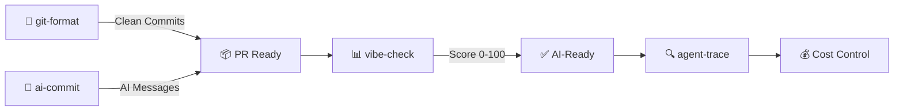

[English](README.md) | [中文](README.zh.md) | [日本語](README.ja.md) | [Français](README.fr.md) | [Español](README.es.md) | [العربية](README.ar.md) | [한국어](README.ko.md) | [Português](README.pt.md) | [Русский](README.ru.md) | [Deutsch](README.de.md)

<!-- ═══════════════════════════════════════════════════════════════ -->
<!-- HEADER: Animated Terminal                                       -->
<!-- ═══════════════════════════════════════════════════════════════ -->

<div align="center">


</div>


<br/>

<!-- ═══════════════════════════════════════════════════════════════ -->
<!-- BADGES: npm downloads + profile stats                           -->
<!-- ═══════════════════════════════════════════════════════════════ -->

<a href="https://www.npmjs.com/package/git-format"></a>
<a href="https://www.npmjs.com/package/ai-commit"></a>
<a href="https://www.npmjs.com/package/agent-trace"></a>
<a href="https://www.npmjs.com/package/vibe-check"></a>

<br/>

<a href="https://github.com/liangzhengtao"></a>

<a href="https://github.com/liangzhengtao?tab=repositories"></a>

</div>

---

<!-- ═══════════════════════════════════════════════════════════════ -->
<!-- ABOUT ME                                                        -->
<!-- ═══════════════════════════════════════════════════════════════ -->

## 👋 Über mich

Ich bin ein Entwickler, der sich auf den Bau KI-gestützter CLI-Tools spezialisiert hat. Meine Tools helfen Entwicklern bei:
- **Git-Workflows** — automatische Formatierung von Commits, KI-generierte Nachrichten
- **KI-Agenten-Überwachung** — Kosten, Tokens und Tool-Zustand verfolgen
- **Projekt-Audits** — KI-Bereitschaft Ihrer Codebasis bewerten

Alle Tools sind Open Source, MIT-lizenziert und können mit `npx` ausgeführt werden — keine Installation erforderlich.

---

<!-- ═══════════════════════════════════════════════════════════════ -->
<!-- QUICK TRY: Terminal Demo                                        -->
<!-- ═══════════════════════════════════════════════════════════════ -->

## ⚡ In 10 Sekunden testen

```bash
# Format messy git history → clean Conventional Commits
npx git-format

# AI writes your commit messages
npx ai-commit

# Score your project's AI-readiness (0-100)
npx @liangzhengtao/vibe-check

# Track your AI agent — costs, tokens, tool calls
npx agent-trace
```

**Kein Klonen · Kein API-Schlüssel · Keine Konfiguration · Einfach ausführen**

---

<!-- ═══════════════════════════════════════════════════════════════ -->
<!-- WHAT I BUILD                                                    -->
<!-- ═══════════════════════════════════════════════════════════════ -->

## 🔧 Was ich baue

### Originale CLI-Tools

| Tool | Funktion | Ausprobieren |
|:-----|:---------|:-------------|
| **[git-format](https://github.com/liangzhengtao/git-format)** | Commits in Conventional Commits formatieren | `npx git-format` |
| **[ai-commit](https://github.com/liangzhengtao/ai-commit)** | KI generiert Commit-Nachrichten aus git diff | `npx ai-commit` |
| **[agent-trace](https://github.com/liangzhengtao/agent-trace)** | KI-Agenten-Kosten, Tokens und Tool-Zustand verfolgen | `npx agent-trace` |
| **[vibe-check](https://github.com/liangzhengtao/vibe-check)** | KI-Bereitschaft des Projekts prüfen (Score 0-100) | `npx @liangzhengtao/vibe-check` |

### Kuratierte Sammlungen

| Sammlung | Inhalt |
|:---------|:-------|
| **[awesome-ai-rules](https://github.com/liangzhengtao/awesome-ai-rules)** | 20 produktionsreife KI-Coding-Regeln für Cursor, Claude, Kimi Code |
| **[awesome-mcp-servers](https://github.com/liangzhengtao/awesome-mcp-servers)** | 9 verifizierte MCP-Server-Konfigurationen |
| **[awesome-prompts](https://github.com/liangzhengtao/awesome-prompts)** | 285+ getestete KI-Prompts für jede Aufgabe |

---

<!-- ═══════════════════════════════════════════════════════════════ -->
<!-- TECH STACK: Animated Skill Icons                                -->
<!-- ═══════════════════════════════════════════════════════════════ -->

## 📊 Tech-Stack

<div align="center">

<a href="https://skillicons.dev">

</a>

</div>

---

<!-- ═══════════════════════════════════════════════════════════════ -->
<!-- WORKFLOW: Mermaid Diagram                                        -->
<!-- ═══════════════════════════════════════════════════════════════ -->

## 🔀 Wie meine Tools zusammenarbeiten



---

<!-- ═══════════════════════════════════════════════════════════════ -->
<!-- GITHUB STATS: Animated Cards                                    -->
<!-- ═══════════════════════════════════════════════════════════════ -->

## 📈 GitHub-Statistiken

<div align="center">


<br/>


</div>

---

<!-- ═══════════════════════════════════════════════════════════════ -->
<!-- ACTIVITY GRAPH                                                  -->
<!-- ═══════════════════════════════════════════════════════════════ -->

## 🔥 Aktivität

<div align="center">


</div>

---

<!-- ═══════════════════════════════════════════════════════════════ -->
<!-- ALL PROJECTS                                                    -->
<!-- ═══════════════════════════════════════════════════════════════ -->

## 📂 Alle Projekte (300+)

<details>
<summary><b>🤖 KI-Entwicklungstools (6)</b></summary>

| Projekt | Beschreibung |
|:--------|:-------------|
| [agent-trace](https://github.com/liangzhengtao/agent-trace) | KI-Agent verfolgen — Kosten, Tokens, Tool-Zustand |
| [awesome-ai-rules](https://github.com/liangzhengtao/awesome-ai-rules) | 20 produktionsreife KI-Coding-Regeln |
| [vibe-check](https://github.com/liangzhengtao/vibe-check) | KI-Bereitschaft des Projekts bewerten (0-100) |
| [commit-ai](https://github.com/liangzhengtao/ai-commit) | KI schreibt Commit-Nachrichten |
| [awesome-mcp-servers](https://github.com/liangzhengtao/awesome-mcp-servers) | 9 verifizierte MCP-Server |
| [awesome-ai-agents](https://github.com/liangzhengtao/awesome-ai-agents) | 12 produktionsreife KI-Agent-Skills |

</details>

<details>
<summary><b>📚 Forschung & Karriere (7)</b></summary>

| Projekt | Beschreibung |
|:--------|:-------------|
| [awesome-skills](https://github.com/liangzhengtao/awesome-skills) | 12 Forschungs-Skills (LaTeX, Statistik) |
| [awesome-research-figures](https://github.com/liangzhengtao/awesome-research-figures) | Wissenschaftliche Abbildungen in Publikationsqualität |
| [awesome-interview-skills](https://github.com/liangzhengtao/awesome-interview-skills) | 14 Skills für den Traumjob |
| [system-design-interview](https://github.com/liangzhengtao/system-design-interview) | Systemdesign-Vorbereitung mit ASCII-Diagrammen |
| [awesome-developer-roadmap](https://github.com/liangzhengtao/awesome-developer-roadmap) | 10 Karriere-Roadmaps (Junior → Staff) |
| [build-your-own-x-cn](https://github.com/liangzhengtao/build-your-own-x-cn) | Technologien von Grund auf bauen (10 Tutorials) |
| [leetcode-patterns-cn](https://github.com/liangzhengtao/leetcode-patterns-cn) | 8 Algorithmen-Patterns, 72 Aufgaben |

</details>

<details>
<summary><b>🎬 Video & Kreatives (7)</b></summary>

| Projekt | Beschreibung |
|:--------|:-------------|
| [awesome-video-prompts](https://github.com/liangzhengtao/awesome-video-prompts) | 200+ Prompts (Sora, Runway, Kling) |
| [awesome-video-to-text](https://github.com/liangzhengtao/awesome-video-to-text) | 12 Transkriptions-Skills |
| [awesome-video-creation](https://github.com/liangzhengtao/awesome-video-creation) | 14 Video-Workflow-Skills |
| [awesome-video-skills](https://github.com/liangzhengtao/awesome-video-skills) | 10 Video-Bearbeitungs-Skills |
| [awesome-creative-skills](https://github.com/liangzhengtao/awesome-creative-skills) | 10 kreative Skills (Poster, Logos) |
| [awesome-writing-skills](https://github.com/liangzhengtao/awesome-writing-skills) | 12 Schreib-Skills (Blog, SEO) |
| [awesome-prompts](https://github.com/liangzhengtao/awesome-prompts) | 285+ KI-Prompts für jede Aufgabe |

</details>

<details>
<summary><b>🛠️ Entwickler-Ressourcen (8)</b></summary>

| Projekt | Beschreibung |
|:--------|:-------------|
| [awesome-dev-tools](https://github.com/liangzhengtao/awesome-dev-tools) | 50+ Entwickler-Tools nach Kategorie |
| [awesome-devops-skills](https://github.com/liangzhengtao/awesome-devops-skills) | 12 DevOps-Skills (CI/CD, K8s) |
| [awesome-security-skills](https://github.com/liangzhengtao/awesome-security-skills) | 12 Cybersecurity-Skills |
| [awesome-startup-skills](https://github.com/liangzhengtao/awesome-startup-skills) | 12 Skills für Gründer |
| [ai-agent-architectures](https://github.com/liangzhengtao/ai-agent-architectures) | 7 KI-Agent-Patterns |
| [open-source-llm-guide](https://github.com/liangzhengtao/open-source-llm-guide) | LLMs auf eigener Hardware ausführen |
| [github-stars-analysis](https://github.com/liangzhengtao/github-stars-analysis) | Analyse der GitHub-Star-Trends |
| [awesome-chinese-developer-tools](https://github.com/liangzhengtao/awesome-chinese-developer-tools) | Chinesische Entwickler-Tools |

</details>

<details>
<summary><b>📁 Persönlich (4)</b></summary>

| Projekt | Beschreibung |
|:--------|:-------------|
| [my-dotfiles](https://github.com/liangzhengtao/my-dotfiles) | Entwicklungsumgebung (Zsh, Git, Neovim) |
| [guizhou-exam-papers](https://github.com/liangzhengtao/guizhou-exam-papers) | Prüfungsunterlagen aus Guizhou (kostenlos für Studenten) |
| [blog](https://github.com/liangzhengtao/blog) | Technische Blog-Beiträge |
| [git-format](https://github.com/liangzhengtao/git-format) | Commits in Conventional Commits formatieren |

</details>

---

<!-- ═══════════════════════════════════════════════════════════════ -->
<!-- FOOTER                                                          -->
<!-- ═══════════════════════════════════════════════════════════════ -->

<div align="center">

### 🤝 Kontakt

[](https://github.com/liangzhengtao)
[](https://github.com/liangzhengtao/blog)

**300+ Projekte · Alles Open Source · Alles kostenlos**

*Wenn Ihnen eines davon Zeit gespart hat, ⭐ das meistgenutzte Repository.*

</div>
