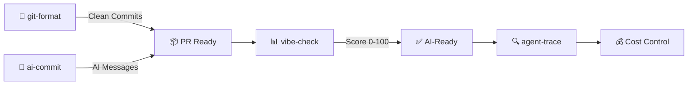

[English](README.md) | [中文](README.zh.md) | [日本語](README.ja.md) | [Français](README.fr.md) | [Español](README.es.md) | [العربية](README.ar.md) | [한국어](README.ko.md) | [Português](README.pt.md) | [Русский](README.ru.md) | [Deutsch](README.de.md)

<!-- ═══════════════════════════════════════════════════════════════ -->
<!-- HEADER: Animated Terminal                                       -->
<!-- ═══════════════════════════════════════════════════════════════ -->

<div align="center">


</div>


<br/>

<!-- ═══════════════════════════════════════════════════════════════ -->
<!-- BADGES: npm downloads + profile stats                           -->
<!-- ═══════════════════════════════════════════════════════════════ -->

<a href="https://www.npmjs.com/package/git-format"></a>
<a href="https://www.npmjs.com/package/ai-commit"></a>
<a href="https://www.npmjs.com/package/agent-trace"></a>
<a href="https://www.npmjs.com/package/vibe-check"></a>

<br/>

<a href="https://github.com/Serennity007"></a>

<a href="https://github.com/Serennity007?tab=repositories"></a>

</div>

---

<!-- ═══════════════════════════════════════════════════════════════ -->
<!-- ABOUT ME                                                        -->
<!-- ═══════════════════════════════════════════════════════════════ -->

## 👋 À propos

Je suis un développeur spécialisé dans la création d'outils CLI propulsés par l'IA. Mes outils aident les développeurs avec :
- **Workflows Git** — formatage automatique des commits, messages générés par IA
- **Monitoring d'agents IA** — suivi des coûts, tokens, santé des outils
- **Audit de projets** — évaluation de la préparation AI de votre codebase

Tous les outils sont open source, sous licence MIT, et peuvent être exécutés avec `npx` — aucune installation requise.

---

<!-- ═══════════════════════════════════════════════════════════════ -->
<!-- QUICK TRY: Terminal Demo                                        -->
<!-- ═══════════════════════════════════════════════════════════════ -->

## ⚡ Essayez-en un en 10 secondes

```bash
# Format messy git history → clean Conventional Commits
npx git-format

# AI writes your commit messages
npx ai-commit

# Score your project's AI-readiness (0-100)
npx @Serennity007/vibe-check

# Track your AI agent — costs, tokens, tool calls
npx agent-trace
```

**Pas de clone · Pas de clé API · Pas de configuration · Exécutez-le simplement**

---

<!-- ═══════════════════════════════════════════════════════════════ -->
<!-- WHAT I BUILD                                                    -->
<!-- ═══════════════════════════════════════════════════════════════ -->

## 🔧 Ce que je construis

### Outils CLI originaux

| Outil | Ce qu'il fait | Essayez-le |
|:------|:--------------|:-----------|
| **[git-format](https://github.com/Serennity007/git-format)** | Formater les commits en Conventional Commits | `npx git-format` |
| **[ai-commit](https://github.com/Serennity007/ai-commit)** | L'IA génère des messages de commit à partir du git diff | `npx ai-commit` |
| **[agent-trace](https://github.com/Serennity007/agent-trace)** | Suivre les coûts, tokens et santé des outils de l'agent IA | `npx agent-trace` |
| **[vibe-check](https://github.com/Serennity007/vibe-check)** | Auditer la préparation AI du projet (score 0-100) | `npx @Serennity007/vibe-check` |

### Collections sélectionnées

| Collection | Contenu |
|:-----------|:--------|
| **[awesome-ai-rules](https://github.com/Serennity007/awesome-ai-rules)** | 20 règles de codage IA en production pour Cursor, Claude, Kimi Code |
| **[awesome-mcp-servers](https://github.com/Serennity007/awesome-mcp-servers)** | 9 configurations de serveurs MCP vérifiées |
| **[awesome-prompts](https://github.com/Serennity007/awesome-prompts)** | 285+ prompts IA testés pour chaque tâche |

---

<!-- ═══════════════════════════════════════════════════════════════ -->
<!-- TECH STACK: Animated Skill Icons                                -->
<!-- ═══════════════════════════════════════════════════════════════ -->

## 📊 Stack technique

<div align="center">

<a href="https://skillicons.dev">

</a>

</div>

---

<!-- ═══════════════════════════════════════════════════════════════ -->
<!-- WORKFLOW: Mermaid Diagram                                        -->
<!-- ═══════════════════════════════════════════════════════════════ -->

## 🔀 Comment mes outils fonctionnent ensemble



---

<!-- ═══════════════════════════════════════════════════════════════ -->
<!-- GITHUB STATS: Animated Cards                                    -->
<!-- ═══════════════════════════════════════════════════════════════ -->

## 📈 Statistiques GitHub

<div align="center">


<br/>


</div>

---

<!-- ═══════════════════════════════════════════════════════════════ -->
<!-- ACTIVITY GRAPH                                                  -->
<!-- ═══════════════════════════════════════════════════════════════ -->

## 🔥 Activité

<div align="center">


</div>

---

<!-- ═══════════════════════════════════════════════════════════════ -->
<!-- ALL PROJECTS                                                    -->
<!-- ═══════════════════════════════════════════════════════════════ -->

## 📂 Tous les projets (300+)

<details>
<summary><b>🤖 Outils développeur IA (6)</b></summary>

| Projet | Description |
|:-------|:------------|
| [agent-trace](https://github.com/Serennity007/agent-trace) | Suivre l'agent IA — coûts, tokens, santé des outils |
| [awesome-ai-rules](https://github.com/Serennity007/awesome-ai-rules) | 20 règles de codage IA en production |
| [vibe-check](https://github.com/Serennity007/vibe-check) | Évaluer la préparation AI du projet (0-100) |
| [commit-ai](https://github.com/Serennity007/ai-commit) | L'IA écrit les messages de commit |
| [awesome-mcp-servers](https://github.com/Serennity007/awesome-mcp-servers) | 9 serveurs MCP vérifiés |
| [awesome-ai-agents](https://github.com/Serennity007/awesome-ai-agents) | 12 compétences d'agents IA en production |

</details>

<details>
<summary><b>📚 Recherche & Carrière (7)</b></summary>

| Projet | Description |
|:-------|:------------|
| [awesome-skills](https://github.com/Serennity007/awesome-skills) | 12 compétences de recherche (LaTeX, stats) |
| [awesome-research-figures](https://github.com/Serennity007/awesome-research-figures) | Figures scientifiques de qualité publication |
| [awesome-interview-skills](https://github.com/Serennity007/awesome-interview-skills) | 14 compétences pour décrocher le job de vos rêves |
| [system-design-interview](https://github.com/Serennity007/system-design-interview) | Préparation au system design avec diagrammes ASCII |
| [awesome-developer-roadmap](https://github.com/Serennity007/awesome-developer-roadmap) | 10 feuilles de route de carrière (junior → staff) |
| [build-your-own-x-cn](https://github.com/Serennity007/build-your-own-x-cn) | Construire la techno de zéro (10 tutoriels) |
| [leetcode-patterns-cn](https://github.com/Serennity007/leetcode-patterns-cn) | 8 patterns d'algorithmes, 72 problèmes |

</details>

<details>
<summary><b>🎬 Vidéo & Création (7)</b></summary>

| Projet | Description |
|:-------|:------------|
| [awesome-video-prompts](https://github.com/Serennity007/awesome-video-prompts) | 200+ prompts (Sora, Runway, Kling) |
| [awesome-video-to-text](https://github.com/Serennity007/awesome-video-to-text) | 12 compétences de transcription |
| [awesome-video-creation](https://github.com/Serennity007/awesome-video-creation) | 14 compétences de workflow vidéo |
| [awesome-video-skills](https://github.com/Serennity007/awesome-video-skills) | 10 compétences de montage vidéo |
| [awesome-creative-skills](https://github.com/Serennity007/awesome-creative-skills) | 10 compétences créatives (affiches, logos) |
| [awesome-writing-skills](https://github.com/Serennity007/awesome-writing-skills) | 12 compétences rédactionnelles (blog, SEO) |
| [awesome-prompts](https://github.com/Serennity007/awesome-prompts) | 285+ prompts IA pour chaque tâche |

</details>

<details>
<summary><b>🛠️ Ressources développeur (8)</b></summary>

| Projet | Description |
|:-------|:------------|
| [awesome-dev-tools](https://github.com/Serennity007/awesome-dev-tools) | 50+ outils développeur par catégorie |
| [awesome-devops-skills](https://github.com/Serennity007/awesome-devops-skills) | 12 compétences DevOps (CI/CD, K8s) |
| [awesome-security-skills](https://github.com/Serennity007/awesome-security-skills) | 12 compétences en cybersécurité |
| [awesome-startup-skills](https://github.com/Serennity007/awesome-startup-skills) | 12 compétences pour les fondateurs |
| [ai-agent-architectures](https://github.com/Serennity007/ai-agent-architectures) | 7 modèles d'agents IA |
| [open-source-llm-guide](https://github.com/Serennity007/open-source-llm-guide) | Exécuter des LLMs sur votre propre matériel |
| [github-stars-analysis](https://github.com/Serennity007/github-stars-analysis) | Analyse des tendances des étoiles GitHub |
| [awesome-chinese-developer-tools](https://github.com/Serennity007/awesome-chinese-developer-tools) | Outils développeur chinois |

</details>

<details>
<summary><b>📁 Personnel (4)</b></summary>

| Projet | Description |
|:-------|:------------|
| [my-dotfiles](https://github.com/Serennity007/my-dotfiles) | Environnement de dev (Zsh, Git, Neovim) |
| [guizhou-exam-papers](https://github.com/Serennity007/guizhou-exam-papers) | Sujets d'examen du Guizhou (gratuit pour les étudiants) |
| [blog](https://github.com/Serennity007/blog) | Articles de blog techniques |
| [git-format](https://github.com/Serennity007/git-format) | Formater les commits en Conventional Commits |

</details>

---

<!-- ═══════════════════════════════════════════════════════════════ -->
<!-- FOOTER                                                          -->
<!-- ═══════════════════════════════════════════════════════════════ -->

<div align="center">

### 🤝 Connecter

[](https://github.com/Serennity007)
[](https://github.com/Serennity007/blog)

**300+ projets · Tout open source · Tout gratuit**

*Si l'un de ces outils vous a fait gagner du temps, ⭐ le repo que vous avez le plus utilisé.*

</div>
