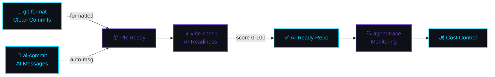

[English](README.md) | [中文](README.zh.md) | [日本語](README.ja.md) | [Français](README.fr.md) | [Español](README.es.md) | [العربية](README.ar.md) | [한국어](README.ko.md) | [Português](README.pt.md) | [Русский](README.ru.md) | [Deutsch](README.de.md)

<!-- ═══════════════════════════════════════════════════════════════════════════════ -->
<!-- ██  HEADER: Deep Space Terminal  ██ -->
<!-- ═══════════════════════════════════════════════════════════════════════════════ -->


<div align="center">

<!-- Terminal-style name -->
```
 ███████╗██╗  ██╗███████╗███╗   ██╗ ██████╗ ████████╗ █████╗  ██████╗ 
 ╚══██╔╝██║  ██║██╔════╝████╗  ██║██╔═══██╗╚══██╔══╝██╔══██╗██╔═══██╗
    ██║ ███████║█████╗  ██╔██╗ ██║██║   ██║   ██║   ███████║██║   ██║
    ██║ ██╔══██║██╔══╝  ██║╚██╗██║██║   ██║   ██║   ██╔══██║██║   ██║
    ██║ ██║  ██║███████╗██║ ╚████║╚██████╔╝   ██║   ██║  ██║╚██████╔╝
    ╚═╝ ╚═╝  ╚═╝╚══════╝╚═╝  ╚═══╝ ╚═════╝    ╚═╝   ╚═╝  ╚═╝ ╚═════╝
```

<!-- Animated typing effect -->


<br/>

<!-- Badges row 1: npm downloads -->
<a href="https://www.npmjs.com/package/git-format"></a>
<a href="https://www.npmjs.com/package/ai-commit"></a>
<a href="https://www.npmjs.com/package/agent-trace"></a>
<a href="https://www.npmjs.com/package/vibe-check"></a>

<!-- Badges row 2: profile stats -->
<a href="https://github.com/liangzhengtao"></a>

<a href="https://github.com/liangzhengtao?tab=repositories"></a>

</div>

---

<!-- ═══════════════════════════════════════════════════════════════════════════════ -->
<!-- ██  QUICK TRY: Terminal Demo  ██ -->
<!-- ═══════════════════════════════════════════════════════════════════════════════ -->

<div align="center">

```
┌──────────────────────────────────────────────────────────────────────┐
│  $ npx git-format                                                    │
│  ✓ feat(auth): ログインバリデーション追加                              │
│                                                                      │
│  $ npx ai-commit                                                     │
│  ✓ fix(api): ユーザーエンドポイントのnullレスポンス処理                  │
│                                                                      │
│  $ npx @liangzhengtao/vibe-check                                     │
│  ┌────────────────────────────────────────────────────────────────┐  │
│  │ ✨ Score: 83/100 │ Grade: A                                    │  │
│  │ 素晴らしい！プロジェクトはAI対応度が高いです。                     │  │
│  └────────────────────────────────────────────────────────────────┘  │
│                                                                      │
│  $ npx agent-trace                                                   │
│  📊 Sessions: 64 │ Cost: $4681 │ Tokens: 2.3B                       │
│                                                                      │
│  クローン不要 · APIキー不要 · 設定不要 · 実行するだけ                    │
└──────────────────────────────────────────────────────────────────────┘
```

</div>

---

<!-- ═══════════════════════════════════════════════════════════════════════════════ -->
<!-- ██  WHAT I BUILD  ██ -->
<!-- ═══════════════════════════════════════════════════════════════════════════════ -->

<div align="center">

### `>_` 構築内容

</div>

<table>
<tr>
<td width="50%" valign="top">

#### 🔧 オリジナルCLIツール

| ツール | コマンド |
|:-----|:--------|
| **[git-format](https://github.com/liangzhengtao/git-format)** — Conventional Commits | `npx git-format` |
| **[ai-commit](https://github.com/liangzhengtao/ai-commit)** — AIコミットメッセージ | `npx ai-commit` |
| **[agent-trace](https://github.com/liangzhengtao/agent-trace)** — エージェント監視 | `npx agent-trace` |
| **[vibe-check](https://github.com/liangzhengtao/vibe-check)** — AI対応度監査 | `npx @liangzhengtao/vibe-check` |

</td>
<td width="50%" valign="top">

#### 📦 厳選コレクション

| コレクション | ハイライト |
|:-----------|:-----------|
| **[awesome-ai-rules](https://github.com/liangzhengtao/awesome-ai-rules)** | 本番対応のAIコーディングルール20選 |
| **[awesome-mcp-servers](https://github.com/liangzhengtao/awesome-mcp-servers)** | 検証済みMCP設定9件 |
| **[awesome-prompts](https://github.com/liangzhengtao/awesome-prompts)** | 285以上のAIプロンプト |

</td>
</tr>
</table>

---

<!-- ═══════════════════════════════════════════════════════════════════════════════ -->
<!-- ██  ANALYTICS  ██ -->
<!-- ═══════════════════════════════════════════════════════════════════════════════ -->

<div align="center">

### `>_` 分析


<br/>


</div>

---

<!-- ═══════════════════════════════════════════════════════════════════════════════ -->
<!-- ██  TECH STACK  ██ -->
<!-- ═══════════════════════════════════════════════════════════════════════════════ -->

<div align="center">

### `>_` 技術スタック

<!-- Languages -->


<!-- AI/ML -->


<!-- Frontend -->


<!-- Backend -->


<!-- DevOps -->


<!-- Tools -->


</div>

---

<!-- ═══════════════════════════════════════════════════════════════════════════════ -->
<!-- ██  WORKFLOW  ██ -->
<!-- ═══════════════════════════════════════════════════════════════════════════════ -->

<div align="center">

### `>_` ワークフロー

</div>



---

<!-- ═══════════════════════════════════════════════════════════════════════════════ -->
<!-- ██  ALL PROJECTS  ██ -->
<!-- ═══════════════════════════════════════════════════════════════════════════════ -->

<div align="center">

### `>_` 全プロジェクト `33`

</div>

<details>
<summary><b> AI開発ツール (6)</b></summary>
<br>

| プロジェクト | 説明 |
|:--------|:------------|
| [agent-trace](https://github.com/liangzhengtao/agent-trace) | AIエージェント追跡 — コスト、トークン、ツール健全性 |
| [awesome-ai-rules](https://github.com/liangzhengtao/awesome-ai-rules) | 本番対応のAIコーディングルール20選 |
| [vibe-check](https://github.com/liangzhengtao/vibe-check) | プロジェクトのAI対応度をスコアリング (0-100) |
| [commit-ai](https://github.com/liangzhengtao/ai-commit) | AIがコミットメッセージを生成 |
| [awesome-mcp-servers](https://github.com/liangzhengtao/awesome-mcp-servers) | 検証済みMCPサーバー9件 |
| [awesome-ai-agents](https://github.com/liangzhengtao/awesome-ai-agents) | 本番対応のAIエージェントスキル12選 |

</details>

<details>
<summary><b> 研究＆キャリア (7)</b></summary>
<br>

| プロジェクト | 説明 |
|:--------|:------------|
| [awesome-skills](https://github.com/liangzhengtao/awesome-skills) | 研究スキル12選 (LaTeX、統計) |
| [awesome-research-figures](https://github.com/liangzhengtao/awesome-research-figures) | 出版品質の科学図表 |
| [awesome-interview-skills](https://github.com/liangzhengtao/awesome-interview-skills) | 理想の仕事に就くためのスキル14選 |
| [system-design-interview](https://github.com/liangzhengtao/system-design-interview) | ASCII図解によるシステム設計準備 |
| [awesome-developer-roadmap](https://github.com/liangzhengtao/awesome-developer-roadmap) | キャリアロードマップ10選 (ジュニア → スタッフ) |
| [build-your-own-x-cn](https://github.com/liangzhengtao/build-your-own-x-cn) | 技術をゼロから構築 (チュートリアル10本) |
| [leetcode-patterns-cn](https://github.com/liangzhengtao/leetcode-patterns-cn) | アルゴリズムパターン8種、問題72問 |

</details>

<details>
<summary><b> 動画＆クリエイティブ (7)</b></summary>
<br>

| プロジェクト | 説明 |
|:--------|:------------|
| [awesome-video-prompts](https://github.com/liangzhengtao/awesome-video-prompts) | 200以上のプロンプト (Sora、Runway、Kling) |
| [awesome-video-to-text](https://github.com/liangzhengtao/awesome-video-to-text) | 文字起こしスキル12選 |
| [awesome-video-creation](https://github.com/liangzhengtao/awesome-video-creation) | 動画ワークフロースキル14選 |
| [awesome-video-skills](https://github.com/liangzhengtao/awesome-video-skills) | 動画編集スキル10選 |
| [awesome-creative-skills](https://github.com/liangzhengtao/awesome-creative-skills) | クリエイティブスキル10選 (ポスター、ロゴ) |
| [awesome-writing-skills](https://github.com/liangzhengtao/awesome-writing-skills) | ライティングスキル12選 (ブログ、SEO) |
| [awesome-prompts](https://github.com/liangzhengtao/awesome-prompts) | あらゆるタスク向け285以上のAIプロンプト |

</details>

<details>
<summary><b> 開発リソース (8)</b></summary>
<br>

| プロジェクト | 説明 |
|:--------|:------------|
| [awesome-dev-tools](https://github.com/liangzhengtao/awesome-dev-tools) | カテゴリ別開発ツール50以上 |
| [awesome-devops-skills](https://github.com/liangzhengtao/awesome-devops-skills) | DevOpsスキル12選 (CI/CD、K8s) |
| [awesome-security-skills](https://github.com/liangzhengtao/awesome-security-skills) | サイバーセキュリティスキル12選 |
| [awesome-startup-skills](https://github.com/liangzhengtao/awesome-startup-skills) | 起業家向けスキル12選 |
| [ai-agent-architectures](https://github.com/liangzhengtao/ai-agent-architectures) | AIエージェントパターン7種 |
| [open-source-llm-guide](https://github.com/liangzhengtao/open-source-llm-guide) | 自分のハードウェアでLLMを実行 |
| [github-stars-analysis](https://github.com/liangzhengtao/github-stars-analysis) | GitHubスターのトレンド分析 |
| [awesome-chinese-developer-tools](https://github.com/liangzhengtao/awesome-chinese-developer-tools) | 中国語開発者ツール |

</details>

<details>
<summary><b> 個人 (4)</b></summary>
<br>

| プロジェクト | 説明 |
|:--------|:------------|
| [my-dotfiles](https://github.com/liangzhengtao/my-dotfiles) | 開発環境 (Zsh、Git、Neovim) |
| [guizhou-exam-papers](https://github.com/liangzhengtao/guizhou-exam-papers) | 貴州省試験過去問 (学生無料) |
| [blog](https://github.com/liangzhengtao/blog) | 技術ブログ記事 |
| [git-format](https://github.com/liangzhengtao/git-format) | コミットをConventional Commits形式にフォーマット |

</details>

---

<!-- ═══════════════════════════════════════════════════════════════════════════════ -->
<!-- ██  FOOTER  ██ -->
<!-- ═══════════════════════════════════════════════════════════════════════════════ -->

<div align="center">

### `>_` 接続

[](https://github.com/liangzhengtao)
[](https://github.com/liangzhengtao/blog)

<br/>

**33プロジェクト · すべてオープンソース · すべて無料**

*これらのプロジェクトが時間の節約になったら、最も使用したリポジトリに⭐を付けてください。*

<br/>


</div>
