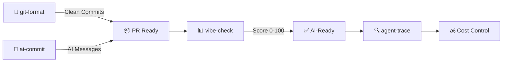

[English](README.md) | [中文](README.zh.md) | [日本語](README.ja.md) | [Français](README.fr.md) | [Español](README.es.md) | [العربية](README.ar.md) | [한국어](README.ko.md) | [Português](README.pt.md) | [Русский](README.ru.md) | [Deutsch](README.de.md)

<!-- ═══════════════════════════════════════════════════════════════ -->
<!-- HEADER: Animated Terminal                                       -->
<!-- ═══════════════════════════════════════════════════════════════ -->

<div align="center">


</div>


<br/>

<!-- ═══════════════════════════════════════════════════════════════ -->
<!-- BADGES: npm downloads + profile stats                           -->
<!-- ═══════════════════════════════════════════════════════════════ -->

<a href="https://www.npmjs.com/package/git-format"></a>
<a href="https://www.npmjs.com/package/ai-commit"></a>
<a href="https://www.npmjs.com/package/agent-trace"></a>
<a href="https://www.npmjs.com/package/vibe-check"></a>

<br/>

<a href="https://github.com/Serennity007"></a>

<a href="https://github.com/Serennity007?tab=repositories"></a>

</div>

---

<!-- ═══════════════════════════════════════════════════════════════ -->
<!-- ABOUT ME                                                        -->
<!-- ═══════════════════════════════════════════════════════════════ -->

## 👋 自己紹介

AI 駆動の CLI ツール構築に注力している開発者です。私のツールは開発者の以下を支援します：
- **Git ワークフロー** — コミットの自動フォーマット、AI によるメッセージ生成
- **AI エージェント監視** — コスト、トークン、ツールの健全性を追跡
- **プロジェクト監査** — コードベースの AI 対応度をスコアリング

すべてのツールはオープンソースで MIT ライセンス、`npx` で実行可能 — インストール不要です。

---

<!-- ═══════════════════════════════════════════════════════════════ -->
<!-- QUICK TRY: Terminal Demo                                        -->
<!-- ═══════════════════════════════════════════════════════════════ -->

## ⚡ 10秒で試す

```bash
# ごちゃごちゃの git 履歴 → 整った Conventional Commits
npx git-format

# AI がコミットメッセージを書いてくれる
npx ai-commit

# プロジェクトの AI 対応度をスコアリング（0-100）
npx @Serennity007/vibe-check

# AI エージェントを追跡 — コスト、トークン、ツール呼び出し
npx agent-trace
```

**クローン不要 · API キー不要 · 設定不要 · そのまま実行**

---

<!-- ═══════════════════════════════════════════════════════════════ -->
<!-- WHAT I BUILD                                                    -->
<!-- ═══════════════════════════════════════════════════════════════ -->

## 🔧 作っているもの

### オリジナル CLI ツール

| ツール | 概要 | 試す |
|:-------|:-----|:-----|
| **[git-format](https://github.com/Serennity007/git-format)** | コミットを Conventional Commits 形式にフォーマット | `npx git-format` |
| **[ai-commit](https://github.com/Serennity007/ai-commit)** | AI が git diff からコミットメッセージを生成 | `npx ai-commit` |
| **[agent-trace](https://github.com/Serennity007/agent-trace)** | AI エージェントのコスト・トークン・ツール健全性を追跡 | `npx agent-trace` |
| **[vibe-check](https://github.com/Serennity007/vibe-check)** | プロジェクトの AI 対応度を監査（0-100 スコア） | `npx @Serennity007/vibe-check` |

### キュレーションコレクション

| コレクション | 内容 |
|:-------------|:-----|
| **[awesome-ai-rules](https://github.com/Serennity007/awesome-ai-rules)** | Cursor、Claude、Kimi Code 向け 20 の本番環境 AI コーディングルール |
| **[awesome-mcp-servers](https://github.com/Serennity007/awesome-mcp-servers)** | 検証済み MCP サーバー設定 9 件 |
| **[awesome-prompts](https://github.com/Serennity007/awesome-prompts)** | あらゆるタスク向け 285+ のテスト済み AI プロンプト |

---

<!-- ═══════════════════════════════════════════════════════════════ -->
<!-- TECH STACK: Animated Skill Icons                                -->
<!-- ═══════════════════════════════════════════════════════════════ -->

## 📊 技術スタック

<div align="center">

<a href="https://skillicons.dev">

</a>

</div>

---

<!-- ═══════════════════════════════════════════════════════════════ -->
<!-- WORKFLOW: Mermaid Diagram                                        -->
<!-- ═══════════════════════════════════════════════════════════════ -->

## 🔀 ツールの連携



---

<!-- ═══════════════════════════════════════════════════════════════ -->
<!-- GITHUB STATS: Animated Cards                                    -->
<!-- ═══════════════════════════════════════════════════════════════ -->

## 📈 GitHub 統計

<div align="center">


<br/>


</div>

---

<!-- ═══════════════════════════════════════════════════════════════ -->
<!-- ACTIVITY GRAPH                                                  -->
<!-- ═══════════════════════════════════════════════════════════════ -->

## 🔥 アクティビティ

<div align="center">


</div>

---

<!-- ═══════════════════════════════════════════════════════════════ -->
<!-- ALL PROJECTS                                                    -->
<!-- ═══════════════════════════════════════════════════════════════ -->

## 📂 全プロジェクト（300+）

<details>
<summary><b>🤖 AI 開発ツール（6）</b></summary>

| プロジェクト | 概要 |
|:-------------|:-----|
| [agent-trace](https://github.com/Serennity007/agent-trace) | AI エージェントを追跡 — コスト、トークン、ツール健全性 |
| [awesome-ai-rules](https://github.com/Serennity007/awesome-ai-rules) | 20 の本番環境 AI コーディングルール |
| [vibe-check](https://github.com/Serennity007/vibe-check) | プロジェクトの AI 対応度をスコアリング（0-100） |
| [commit-ai](https://github.com/Serennity007/ai-commit) | AI がコミットメッセージを生成 |
| [awesome-mcp-servers](https://github.com/Serennity007/awesome-mcp-servers) | 検証済み MCP サーバー 9 件 |
| [awesome-ai-agents](https://github.com/Serennity007/awesome-ai-agents) | 12 の本番環境 AI エージェントスキル |

</details>

<details>
<summary><b>📚 研究・キャリア（7）</b></summary>

| プロジェクト | 概要 |
|:-------------|:-----|
| [awesome-skills](https://github.com/Serennity007/awesome-skills) | 12 の研究スキル（LaTeX、統計） |
| [awesome-research-figures](https://github.com/Serennity007/awesome-research-figures) | 出版品質の科学図表 |
| [awesome-interview-skills](https://github.com/Serennity007/awesome-interview-skills) | 理想の仕事を得るための 14 スキル |
| [system-design-interview](https://github.com/Serennity007/system-design-interview) | ASCII 図解付きシステム設計面接対策 |
| [awesome-developer-roadmap](https://github.com/Serennity007/awesome-developer-roadmap) | 10 のキャリアロードマップ（ジュニア → スタッフ） |
| [build-your-own-x-cn](https://github.com/Serennity007/build-your-own-x-cn) | 技術をゼロから構築（10 チュートリアル） |
| [leetcode-patterns-cn](https://github.com/Serennity007/leetcode-patterns-cn) | 8 アルゴリズムパターン、72 問題 |

</details>

<details>
<summary><b>🎬 動画・クリエイティブ（7）</b></summary>

| プロジェクト | 概要 |
|:-------------|:-----|
| [awesome-video-prompts](https://github.com/Serennity007/awesome-video-prompts) | 200+ プロンプト（Sora、Runway、Kling） |
| [awesome-video-to-text](https://github.com/Serennity007/awesome-video-to-text) | 12 の文字起こしスキル |
| [awesome-video-creation](https://github.com/Serennity007/awesome-video-creation) | 14 の動画ワークフロースキル |
| [awesome-video-skills](https://github.com/Serennity007/awesome-video-skills) | 10 の動画編集スキル |
| [awesome-creative-skills](https://github.com/Serennity007/awesome-creative-skills) | 10 のクリエイティブスキル（ポスター、ロゴ） |
| [awesome-writing-skills](https://github.com/Serennity007/awesome-writing-skills) | 12 のライティングスキル（ブログ、SEO） |
| [awesome-prompts](https://github.com/Serennity007/awesome-prompts) | あらゆるタスク向け 285+ の AI プロンプト |

</details>

<details>
<summary><b>🛠️ 開発者リソース（8）</b></summary>

| プロジェクト | 概要 |
|:-------------|:-----|
| [awesome-dev-tools](https://github.com/Serennity007/awesome-dev-tools) | カテゴリ別 50+ の開発者ツール |
| [awesome-devops-skills](https://github.com/Serennity007/awesome-devops-skills) | 12 の DevOps スキル（CI/CD、K8s） |
| [awesome-security-skills](https://github.com/Serennity007/awesome-security-skills) | 12 のサイバーセキュリティスキル |
| [awesome-startup-skills](https://github.com/Serennity007/awesome-startup-skills) | ファウンダー向け 12 スキル |
| [ai-agent-architectures](https://github.com/Serennity007/ai-agent-architectures) | 7 の AI エージェントアーキテクチャパターン |
| [open-source-llm-guide](https://github.com/Serennity007/open-source-llm-guide) | 自身のハードウェアで LLM を実行 |
| [github-stars-analysis](https://github.com/Serennity007/github-stars-analysis) | GitHub Star トレンド分析 |
| [awesome-chinese-developer-tools](https://github.com/Serennity007/awesome-chinese-developer-tools) | 中国語開発者ツール |

</details>

<details>
<summary><b>📁 個人プロジェクト（4）</b></summary>

| プロジェクト | 概要 |
|:-------------|:-----|
| [my-dotfiles](https://github.com/Serennity007/my-dotfiles) | 開発環境設定（Zsh、Git、Neovim） |
| [guizhou-exam-papers](https://github.com/Serennity007/guizhou-exam-papers) | 貴州省の試験問題（学生無料） |
| [blog](https://github.com/Serennity007/blog) | 技術ブログ記事 |
| [git-format](https://github.com/Serennity007/git-format) | コミットを Conventional Commits 形式にフォーマット |

</details>

---

<!-- ═══════════════════════════════════════════════════════════════ -->
<!-- FOOTER                                                          -->
<!-- ═══════════════════════════════════════════════════════════════ -->

<div align="center">

### 🤝 つながる

[](https://github.com/Serennity007)
[](https://github.com/Serennity007/blog)

**300+ プロジェクト · すべてオープンソース · すべて無料**

*これらのプロジェクトがあなたの時間を節約してくれたら、最もよく使うリポジトリに ⭐ をお願いします。*

</div>
