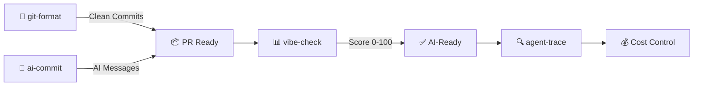

[English](README.md) | [中文](README.zh.md) | [日本語](README.ja.md) | [Français](README.fr.md) | [Español](README.es.md) | [العربية](README.ar.md) | [한국어](README.ko.md) | [Português](README.pt.md) | [Русский](README.ru.md) | [Deutsch](README.de.md)

<!-- ═══════════════════════════════════════════════════════════════ -->
<!-- HEADER: Animated Terminal                                       -->
<!-- ═══════════════════════════════════════════════════════════════ -->

<div align="center">


</div>


<br/>

<!-- ═══════════════════════════════════════════════════════════════ -->
<!-- BADGES: npm downloads + profile stats                           -->
<!-- ═══════════════════════════════════════════════════════════════ -->

<a href="https://www.npmjs.com/package/git-format"></a>
<a href="https://www.npmjs.com/package/ai-commit"></a>
<a href="https://www.npmjs.com/package/agent-trace"></a>
<a href="https://www.npmjs.com/package/vibe-check"></a>

<br/>

<a href="https://github.com/Serennity007"></a>

<a href="https://github.com/Serennity007?tab=repositories"></a>

</div>

---

<!-- ═══════════════════════════════════════════════════════════════ -->
<!-- ABOUT ME                                                        -->
<!-- ═══════════════════════════════════════════════════════════════ -->

## 👋 소개

AI 기반 CLI 도구를 만드는 데 집중하는 개발자입니다. 제 도구는 개발자들을 다음과 같이 돕습니다:
- **Git 워크플로우** — 커밋 자동 포맷팅, AI 생성 메시지
- **AI 에이전트 모니터링** — 비용, 토큰, 도구 상태 추적
- **프로젝트 감사** — 코드베이스의 AI 준비도 점수 평가

모든 도구는 오픈 소스이며 MIT 라이선스로 `npx`로 바로 실행 가능 — 설치 불필요.

---

<!-- ═══════════════════════════════════════════════════════════════ -->
<!-- QUICK TRY: Terminal Demo                                        -->
<!-- ═══════════════════════════════════════════════════════════════ -->

## ⚡ 10초 안에 체험

```bash
# 지저분한 git 히스토리 → 깔끔한 Conventional Commits
npx git-format

# AI가 커밋 메시지를 작성해 줍니다
npx ai-commit

# 프로젝트의 AI 준비도 평가 (0-100)
npx @Serennity007/vibe-check

# AI 에이전트 추적 — 비용, 토큰, 도구 호출
npx agent-trace
```

**클론 불필요 · API 키 불필요 · 설정 불필요 · 바로 실행**

---

<!-- ═══════════════════════════════════════════════════════════════ -->
<!-- WHAT I BUILD                                                    -->
<!-- ═══════════════════════════════════════════════════════════════ -->

## 🔧 만드는 것

### 오리지널 CLI 도구

| 도구 | 설명 | 체험 |
|:-----|:-----|:-----|
| **[git-format](https://github.com/Serennity007/git-format)** | 커밋을 Conventional Commits 형식으로 포맷 | `npx git-format` |
| **[ai-commit](https://github.com/Serennity007/ai-commit)** | AI가 git diff에서 커밋 메시지 생성 | `npx ai-commit` |
| **[agent-trace](https://github.com/Serennity007/agent-trace)** | AI 에이전트 비용·토큰·도구 상태 추적 | `npx agent-trace` |
| **[vibe-check](https://github.com/Serennity007/vibe-check)** | 프로젝트 AI 준비도 감사 (0-100점) | `npx @Serennity007/vibe-check` |

### 큐레이션 컬렉션

| 컬렉션 | 내용 |
|:-------|:-----|
| **[awesome-ai-rules](https://github.com/Serennity007/awesome-ai-rules)** | Cursor, Claude, Kimi Code용 20개 프로덕션 AI 코딩 규칙 |
| **[awesome-mcp-servers](https://github.com/Serennity007/awesome-mcp-servers)** | 검증된 MCP 서버 설정 9개 |
| **[awesome-prompts](https://github.com/Serennity007/awesome-prompts)** | 모든 작업을 위한 285+ 테스트된 AI 프롬프트 |

---

<!-- ═══════════════════════════════════════════════════════════════ -->
<!-- TECH STACK: Animated Skill Icons                                -->
<!-- ═══════════════════════════════════════════════════════════════ -->

## 📊 기술 스택

<div align="center">

<a href="https://skillicons.dev">

</a>

</div>

---

<!-- ═══════════════════════════════════════════════════════════════ -->
<!-- WORKFLOW: Mermaid Diagram                                        -->
<!-- ═══════════════════════════════════════════════════════════════ -->

## 🔀 도구 연동



---

<!-- ═══════════════════════════════════════════════════════════════ -->
<!-- GITHUB STATS: Animated Cards                                    -->
<!-- ═══════════════════════════════════════════════════════════════ -->

## 📈 GitHub 통계

<div align="center">


<br/>


</div>

---

<!-- ═══════════════════════════════════════════════════════════════ -->
<!-- ACTIVITY GRAPH                                                  -->
<!-- ═══════════════════════════════════════════════════════════════ -->

## 🔥 활동

<div align="center">


</div>

---

<!-- ═══════════════════════════════════════════════════════════════ -->
<!-- ALL PROJECTS                                                    -->
<!-- ═══════════════════════════════════════════════════════════════ -->

## 📂 전체 프로젝트（300+）

<details>
<summary><b>🤖 AI 개발 도구（6）</b></summary>

| 프로젝트 | 설명 |
|:---------|:-----|
| [agent-trace](https://github.com/Serennity007/agent-trace) | AI 에이전트 추적 — 비용, 토큰, 도구 상태 |
| [awesome-ai-rules](https://github.com/Serennity007/awesome-ai-rules) | 20개 프로덕션 AI 코딩 규칙 |
| [vibe-check](https://github.com/Serennity007/vibe-check) | 프로젝트 AI 준비도 평가 (0-100점) |
| [commit-ai](https://github.com/Serennity007/ai-commit) | AI가 커밋 메시지 작성 |
| [awesome-mcp-servers](https://github.com/Serennity007/awesome-mcp-servers) | 검증된 MCP 서버 9개 |
| [awesome-ai-agents](https://github.com/Serennity007/awesome-ai-agents) | 12개 프로덕션 AI 에이전트 스킬 |

</details>

<details>
<summary><b>📚 연구·커리어（7）</b></summary>

| 프로젝트 | 설명 |
|:---------|:-----|
| [awesome-skills](https://github.com/Serennity007/awesome-skills) | 12개 연구 스킬 (LaTeX, 통계) |
| [awesome-research-figures](https://github.com/Serennity007/awesome-research-figures) | 출판 품질의 과학 그림 |
| [awesome-interview-skills](https://github.com/Serennity007/awesome-interview-skills) | 원하는 직장을 위한 14가지 스킬 |
| [system-design-interview](https://github.com/Serennity007/system-design-interview) | ASCII 다이어그램이 포함된 시스템 디자인 면접 준비 |
| [awesome-developer-roadmap](https://github.com/Serennity007/awesome-developer-roadmap) | 10개 커리어 로드맵 (주니어 → 스태프) |
| [build-your-own-x-cn](https://github.com/Serennity007/build-your-own-x-cn) | 기술을 처음부터 구축 (10개 튜토리얼) |
| [leetcode-patterns-cn](https://github.com/Serennity007/leetcode-patterns-cn) | 8가지 알고리즘 패턴, 72문제 |

</details>

<details>
<summary><b>🎬 영상·크리에이티브（7）</b></summary>

| 프로젝트 | 설명 |
|:---------|:-----|
| [awesome-video-prompts](https://github.com/Serennity007/awesome-video-prompts) | 200+ 프롬프트 (Sora, Runway, Kling) |
| [awesome-video-to-text](https://github.com/Serennity007/awesome-video-to-text) | 12개 전사 스킬 |
| [awesome-video-creation](https://github.com/Serennity007/awesome-video-creation) | 14개 영상 워크플로우 스킬 |
| [awesome-video-skills](https://github.com/Serennity007/awesome-video-skills) | 10개 영상 편집 스킬 |
| [awesome-creative-skills](https://github.com/Serennity007/awesome-creative-skills) | 10개 크리에이티브 스킬 (포스터, 로고) |
| [awesome-writing-skills](https://github.com/Serennity007/awesome-writing-skills) | 12개 글쓰기 스킬 (블로그, SEO) |
| [awesome-prompts](https://github.com/Serennity007/awesome-prompts) | 모든 작업을 위한 285+ AI 프롬프트 |

</details>

<details>
<summary><b>🛠️ 개발자 리소스（8）</b></summary>

| 프로젝트 | 설명 |
|:---------|:-----|
| [awesome-dev-tools](https://github.com/Serennity007/awesome-dev-tools) | 카테고리별 50+ 개발자 도구 |
| [awesome-devops-skills](https://github.com/Serennity007/awesome-devops-skills) | 12개 DevOps 스킬 (CI/CD, K8s) |
| [awesome-security-skills](https://github.com/Serennity007/awesome-security-skills) | 12개 사이버 보안 스킬 |
| [awesome-startup-skills](https://github.com/Serennity007/awesome-startup-skills) | 창업자를 위한 12가지 스킬 |
| [ai-agent-architectures](https://github.com/Serennity007/ai-agent-architectures) | 7가지 AI 에이전트 아키텍처 패턴 |
| [open-source-llm-guide](https://github.com/Serennity007/open-source-llm-guide) | 자체 하드웨어에서 LLM 실행하기 |
| [github-stars-analysis](https://github.com/Serennity007/github-stars-analysis) | GitHub Star 트렌드 분석 |
| [awesome-chinese-developer-tools](https://github.com/Serennity007/awesome-chinese-developer-tools) | 중국어 개발자 도구 |

</details>

<details>
<summary><b>📁 개인 프로젝트（4）</b></summary>

| 프로젝트 | 설명 |
|:---------|:-----|
| [my-dotfiles](https://github.com/Serennity007/my-dotfiles) | 개발 환경 설정 (Zsh, Git, Neovim) |
| [guizhou-exam-papers](https://github.com/Serennity007/guizhou-exam-papers) | 구이저우 시험지 (학생 무료) |
| [blog](https://github.com/Serennity007/blog) | 기술 블로그 글 |
| [git-format](https://github.com/Serennity007/git-format) | 커밋을 Conventional Commits 형식으로 포맷 |

</details>

---

<!-- ═══════════════════════════════════════════════════════════════ -->
<!-- FOOTER                                                          -->
<!-- ═══════════════════════════════════════════════════════════════ -->

<div align="center">

### 🤝 연결

[](https://github.com/Serennity007)
[](https://github.com/Serennity007/blog)

**300+ 프로젝트 · 모두 오픈 소스 · 모두 무료**

*이 프로젝트들이 시간을 절약해 주었다면, 가장 많이 사용한 리포지토리에 ⭐를 눌러 주세요.*

</div>
