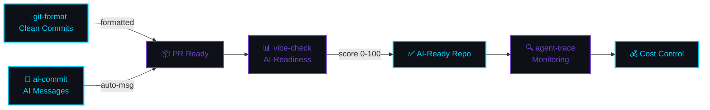

[English](README.md) | [中文](README.zh.md) | [日本語](README.ja.md) | [Français](README.fr.md) | [Español](README.es.md) | [العربية](README.ar.md) | [한국어](README.ko.md) | [Português](README.pt.md) | [Русский](README.ru.md) | [Deutsch](README.de.md)

<!-- ═══════════════════════════════════════════════════════════════════════════════ -->
<!-- ██  HEADER: Deep Space Terminal  ██ -->
<!-- ═══════════════════════════════════════════════════════════════════════════════ -->


<div align="center">

<!-- Terminal-style name -->
```
 ███████╗██╗  ██╗███████╗███╗   ██╗ ██████╗ ████████╗ █████╗  ██████╗ 
 ╚══██╔╝██║  ██║██╔════╝████╗  ██║██╔═══██╗╚══██╔══╝██╔══██╗██╔═══██╗
    ██║ ███████║█████╗  ██╔██╗ ██║██║   ██║   ██║   ███████║██║   ██║
    ██║ ██╔══██║██╔══╝  ██║╚██╗██║██║   ██║   ██║   ██╔══██║██║   ██║
    ██║ ██║  ██║███████╗██║ ╚████║╚██████╔╝   ██║   ██║  ██║╚██████╔╝
    ╚═╝ ╚═╝  ╚═╝╚══════╝╚═╝  ╚═══╝ ╚═════╝    ╚═╝   ╚═╝  ╚═╝ ╚═════╝
```

<!-- Animated typing effect -->


<br/>

<!-- Badges row 1: npm downloads -->
<a href="https://www.npmjs.com/package/git-format"></a>
<a href="https://www.npmjs.com/package/ai-commit"></a>
<a href="https://www.npmjs.com/package/agent-trace"></a>
<a href="https://www.npmjs.com/package/vibe-check"></a>

<!-- Badges row 2: profile stats -->
<a href="https://github.com/liangzhengtao"></a>

<a href="https://github.com/liangzhengtao?tab=repositories"></a>

</div>

---

<!-- ═══════════════════════════════════════════════════════════════════════════════ -->
<!-- ██  QUICK TRY: Terminal Demo  ██ -->
<!-- ═══════════════════════════════════════════════════════════════════════════════ -->

<div align="center">

```
┌──────────────────────────────────────────────────────────────────────┐
│  $ npx git-format                                                    │
│  ✓ feat(auth): 로그인 유효성 검사 추가                                │
│                                                                      │
│  $ npx ai-commit                                                     │
│  ✓ fix(api): 사용자 엔드포인트의 null 응답 처리                        │
│                                                                      │
│  $ npx @liangzhengtao/vibe-check                                     │
│  ┌────────────────────────────────────────────────────────────────┐  │
│  │ ✨ Score: 83/100 │ Grade: A                                    │  │
│  │ 훌륭합니다! 프로젝트의 AI 준비도가 매우 높습니다.                  │  │
│  └────────────────────────────────────────────────────────────────┘  │
│                                                                      │
│  $ npx agent-trace                                                   │
│  📊 Sessions: 64 │ Cost: $4681 │ Tokens: 2.3B                       │
│                                                                      │
│  클론 불필요 · API 키 불필요 · 설정 불필요 · 바로 실행                  │
└──────────────────────────────────────────────────────────────────────┘
```

</div>

---

<!-- ═══════════════════════════════════════════════════════════════════════════════ -->
<!-- ██  WHAT I BUILD  ██ -->
<!-- ═══════════════════════════════════════════════════════════════════════════════ -->

<div align="center">

### `>_` 만드는 것

</div>

<table>
<tr>
<td width="50%" valign="top">

#### 🔧 오리지널 CLI 도구

| 도구 | 명령어 |
|:-----|:--------|
| **[git-format](https://github.com/liangzhengtao/git-format)** — Conventional Commits | `npx git-format` |
| **[ai-commit](https://github.com/liangzhengtao/ai-commit)** — AI 커밋 메시지 | `npx ai-commit` |
| **[agent-trace](https://github.com/liangzhengtao/agent-trace)** — 에이전트 모니터링 | `npx agent-trace` |
| **[vibe-check](https://github.com/liangzhengtao/vibe-check)** — AI 준비도 감사 | `npx @liangzhengtao/vibe-check` |

</td>
<td width="50%" valign="top">

#### 📦 큐레이션된 컬렉션

| 컬렉션 | 하이라이트 |
|:-----------|:-----------|
| **[awesome-ai-rules](https://github.com/liangzhengtao/awesome-ai-rules)** | 프로덕션 AI 코딩 규칙 20가지 |
| **[awesome-mcp-servers](https://github.com/liangzhengtao/awesome-mcp-servers)** | 검증된 MCP 설정 9개 |
| **[awesome-prompts](https://github.com/liangzhengtao/awesome-prompts)** | 285개 이상의 AI 프롬프트 |

</td>
</tr>
</table>

---

<!-- ██████████████████████████████████████████████████████████████████████████████████ -->
<!-- ██  ACHIEVEMENTS                                                            ██ -->
<!-- ██████████████████████████████████████████████████████████████████████████████████ -->

<div align="center">

### `>_` 업적


</div>

---

<!-- ═══════════════════════════════════════════════════════════════════════════════ -->
<!-- ██  ANALYTICS  ██ -->
<!-- ═══════════════════════════════════════════════════════════════════════════════ -->

<div align="center">

### `>_` 분석


<br/>


</div>

---

<!-- ██████████████████████████████████████████████████████████████████████████████████ -->
<!-- ██  ACTIVITY GRAPH                                                          ██ -->
<!-- ██████████████████████████████████████████████████████████████████████████████████ -->

<div align="center">

### `>_` 활동


</div>

---

<!-- ██████████████████████████████████████████████████████████████████████████████████ -->
<!-- ██  STAR HISTORY                                                            ██ -->
<!-- ██████████████████████████████████████████████████████████████████████████████████ -->

<div align="center">

### `>_` STAR 추세

<a href="https://star-history.com/#liangzhengtao/git-format&liangzhengtao/agent-trace&liangzhengtao/ai-commit&Date">
  
</a>

</div>

---

<!-- ═══════════════════════════════════════════════════════════════════════════════ -->
<!-- ██  TECH STACK  ██ -->
<!-- ═══════════════════════════════════════════════════════════════════════════════ -->

<div align="center">

### `>_` 기술 스택

<!-- Languages -->


<!-- AI/ML -->


<!-- Frontend -->


<!-- Backend -->


<!-- DevOps -->


<!-- Tools -->


</div>

---

<!-- ═══════════════════════════════════════════════════════════════════════════════ -->
<!-- ██  WORKFLOW  ██ -->
<!-- ═══════════════════════════════════════════════════════════════════════════════ -->

<div align="center">

### `>_` 워크플로우

</div>



---

<!-- ═══════════════════════════════════════════════════════════════════════════════ -->
<!-- ██  ALL PROJECTS  ██ -->
<!-- ═══════════════════════════════════════════════════════════════════════════════ -->

<div align="center">

### `>_` 전체 프로젝트 `33`

</div>

<details>
<summary><b> AI 개발 도구 (6)</b></summary>
<br>

| 프로젝트 | 설명 |
|:--------|:------------|
| [agent-trace](https://github.com/liangzhengtao/agent-trace) | AI 에이전트 추적 — 비용, 토큰, 도구 상태 |
| [awesome-ai-rules](https://github.com/liangzhengtao/awesome-ai-rules) | 프로덕션 AI 코딩 규칙 20가지 |
| [vibe-check](https://github.com/liangzhengtao/vibe-check) | 프로젝트 AI 준비도 점수 측정 (0-100) |
| [commit-ai](https://github.com/liangzhengtao/ai-commit) | AI가 커밋 메시지 작성 |
| [awesome-mcp-servers](https://github.com/liangzhengtao/awesome-mcp-servers) | 검증된 MCP 서버 9개 |
| [awesome-ai-agents](https://github.com/liangzhengtao/awesome-ai-agents) | 프로덕션 AI 에이전트 스킬 12가지 |

</details>

<details>
<summary><b> 연구 & 커리어 (7)</b></summary>
<br>

| 프로젝트 | 설명 |
|:--------|:------------|
| [awesome-skills](https://github.com/liangzhengtao/awesome-skills) | 연구 스킬 12가지 (LaTeX, 통계) |
| [awesome-research-figures](https://github.com/liangzhengtao/awesome-research-figures) | 출판 품질의 과학 그래프 |
| [awesome-interview-skills](https://github.com/liangzhengtao/awesome-interview-skills) | 이상적인 직장을 위한 스킬 14가지 |
| [system-design-interview](https://github.com/liangzhengtao/system-design-interview) | ASCII 다이어그램으로 시스템 디자인 준비 |
| [awesome-developer-roadmap](https://github.com/liangzhengtao/awesome-developer-roadmap) | 커리어 로드맵 10가지 (주니어 → 스태프) |
| [build-your-own-x-cn](https://github.com/liangzhengtao/build-your-own-x-cn) | 기술을 처음부터 구축 (튜토리얼 10개) |
| [leetcode-patterns-cn](https://github.com/liangzhengtao/leetcode-patterns-cn) | 알고리즘 패턴 8가지, 문제 72개 |

</details>

<details>
<summary><b> 영상 & 크리에이티브 (7)</b></summary>
<br>

| 프로젝트 | 설명 |
|:--------|:------------|
| [awesome-video-prompts](https://github.com/liangzhengtao/awesome-video-prompts) | 200개 이상의 프롬프트 (Sora, Runway, Kling) |
| [awesome-video-to-text](https://github.com/liangzhengtao/awesome-video-to-text) | 전사 스킬 12가지 |
| [awesome-video-creation](https://github.com/liangzhengtao/awesome-video-creation) | 영상 워크플로우 스킬 14가지 |
| [awesome-video-skills](https://github.com/liangzhengtao/awesome-video-skills) | 영상 편집 스킬 10가지 |
| [awesome-creative-skills](https://github.com/liangzhengtao/awesome-creative-skills) | 크리에이티브 스킬 10가지 (포스터, 로고) |
| [awesome-writing-skills](https://github.com/liangzhengtao/awesome-writing-skills) | 글쓰기 스킬 12가지 (블로그, SEO) |
| [awesome-prompts](https://github.com/liangzhengtao/awesome-prompts) | 모든 작업을 위한 285개 이상의 AI 프롬프트 |

</details>

<details>
<summary><b> 개발자 리소스 (8)</b></summary>
<br>

| 프로젝트 | 설명 |
|:--------|:------------|
| [awesome-dev-tools](https://github.com/liangzhengtao/awesome-dev-tools) | 카테고리별 개발자 도구 50개 이상 |
| [awesome-devops-skills](https://github.com/liangzhengtao/awesome-devops-skills) | DevOps 스킬 12가지 (CI/CD, K8s) |
| [awesome-security-skills](https://github.com/liangzhengtao/awesome-security-skills) | 사이버 보안 스킬 12가지 |
| [awesome-startup-skills](https://github.com/liangzhengtao/awesome-startup-skills) | 창업자를 위한 스킬 12가지 |
| [ai-agent-architectures](https://github.com/liangzhengtao/ai-agent-architectures) | AI 에이전트 패턴 7가지 |
| [open-source-llm-guide](https://github.com/liangzhengtao/open-source-llm-guide) | 자체 하드웨어에서 LLM 실행 |
| [github-stars-analysis](https://github.com/liangzhengtao/github-stars-analysis) | GitHub 스타 트렌드 분석 |
| [awesome-chinese-developer-tools](https://github.com/liangzhengtao/awesome-chinese-developer-tools) | 중국 개발자 도구 |

</details>

<details>
<summary><b> 개인 (4)</b></summary>
<br>

| 프로젝트 | 설명 |
|:--------|:------------|
| [my-dotfiles](https://github.com/liangzhengtao/my-dotfiles) | 개발 환경 (Zsh, Git, Neovim) |
| [guizhou-exam-papers](https://github.com/liangzhengtao/guizhou-exam-papers) | 구이저우 시험지 (학생 무료) |
| [blog](https://github.com/liangzhengtao/blog) | 기술 블로그 글 |
| [git-format](https://github.com/liangzhengtao/git-format) | 커밋을 Conventional Commits 형식으로 포맷 |

</details>

---

<!-- ═══════════════════════════════════════════════════════════════════════════════ -->
<!-- ██  FOOTER  ██ -->
<!-- ═══════════════════════════════════════════════════════════════════════════════ -->

<div align="center">

### `>_` 연결

[](https://github.com/liangzhengtao)
[](https://github.com/liangzhengtao/blog)

<br/>

**60+개 프로젝트 · 모두 오픈소스 · 모두 무료**

*이 프로젝트들이 시간을 절약해 주었다면, 가장 많이 사용한 리포지토리에 ⭐를 남겨주세요.*

<br/>


</div>
