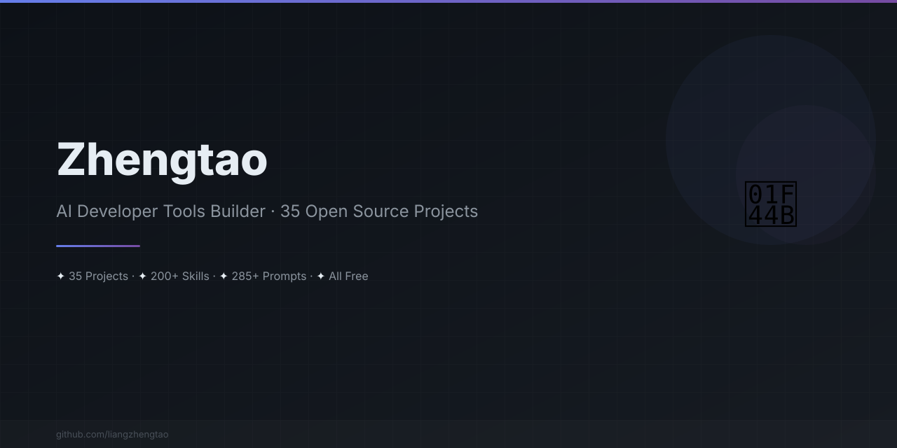

[中文版](README.zh.md)
n<div align="center">



</div>


<div align="center">

# Hey, I'm Zhengtao 👋

### I build tools that save developers hours every week.

**33 open source projects** · **200+ reusable skills** · **285+ AI prompts** · All free, all open source.

[](https://github.com/liangzhengtao)
[](https://github.com/liangzhengtao)

</div>

---

## ⚡ Try These Right Now

```bash
# Clone and run locally (all projects are on GitHub)
git clone https://github.com/liangzhengtao/vibe-check && cd vibe-check && npm install && node bin/cli.js
git clone https://github.com/liangzhengtao/ai-commit && cd ai-commit && npm install && node bin/cli.js
git clone https://github.com/liangzhengtao/agent-trace && cd agent-trace && npm install && node bin/cli.js
git clone https://github.com/liangzhengtao/git-format && cd git-format && npm install && node bin/cli.js

# Or use npx with scoped packages (published)
npx @liangzhengtao/vibe-check    # Score your project's AI-readiness
npx @liangzhengtao/commit-ai     # AI writes your commit messages
```

No API key needed. Copy, paste, done.

---

## 🔥 Featured Projects

| What it does | Try it |
|-------------|--------|
| **Track your AI agent** — costs, tokens, tool health, every conversation | [agent-trace](https://github.com/liangzhengtao/agent-trace) |
| **Score your project** — is it configured for AI coding assistants? | `npx @liangzhengtao/vibe-check` |
| **AI commit messages** — generates conventional commits from staged changes | `npx @liangzhengtao/commit-ai` |
| **20 AI coding rules** — copy-paste config for Cursor, Claude, Kimi Code | [awesome-ai-rules](https://github.com/liangzhengtao/awesome-ai-rules) |
| **9 MCP servers** — verified configs for Cursor, Claude, Kimi Code | [awesome-mcp-servers](https://github.com/liangzhengtao/awesome-mcp-servers) |
| **200+ video prompts** — for Sora, Runway, Pika, Kling | [awesome-video-prompts](https://github.com/liangzhengtao/awesome-video-prompts) |

---

## 📚 All 33 Projects

### AI Developer Tools
| Project | What it does |
|---------|-------------|
| [agent-trace](https://github.com/liangzhengtao/agent-trace) | Trace your AI agent — costs, tokens, tool health, session timeline |
| [awesome-ai-rules](https://github.com/liangzhengtao/awesome-ai-rules) | 20 production AI coding rules (Cursor, Claude, Kimi Code) |
| [vibe-check](https://github.com/liangzhengtao/vibe-check) | Score your project's AI-readiness (0-100) |
| [commit-ai](https://github.com/liangzhengtao/ai-commit) | AI writes your commit messages, no API key needed |
| [awesome-mcp-servers](https://github.com/liangzhengtao/awesome-mcp-servers) | 9 verified MCP servers for AI coding assistants |
| [awesome-ai-agents](https://github.com/liangzhengtao/awesome-ai-agents) | 12 skills for building production AI agents |

### Research & Career
| Project | What it does |
|---------|-------------|
| [awesome-skills](https://github.com/liangzhengtao/awesome-skills) | 12 research skills (LaTeX, stats, literature review) |
| [awesome-research-figures](https://github.com/liangzhengtao/awesome-research-figures) | Publication-quality scientific figures |
| [awesome-interview-skills](https://github.com/liangzhengtao/awesome-interview-skills) | 14 skills to land your dream job |
| [system-design-interview](https://github.com/liangzhengtao/system-design-interview) | System design interview prep with ASCII diagrams |
| [awesome-developer-roadmap](https://github.com/liangzhengtao/awesome-developer-roadmap) | 10 career roadmaps (junior → staff) |
| [build-your-own-x-cn](https://github.com/liangzhengtao/build-your-own-x-cn) | Build tech from scratch (10 tutorials, Chinese) |
| [leetcode-patterns-cn](https://github.com/liangzhengtao/leetcode-patterns-cn) | 8 algorithm patterns, 72 problems (Chinese) |

### Video & Creative
| Project | What it does |
|---------|-------------|
| [awesome-video-prompts](https://github.com/liangzhengtao/awesome-video-prompts) | 200+ prompts for Sora, Runway, Pika, Kling |
| [awesome-video-to-text](https://github.com/liangzhengtao/awesome-video-to-text) | 12 skills for transcription, notes, subtitles |
| [awesome-video-creation](https://github.com/liangzhengtao/awesome-video-creation) | 14 skills for complete video workflow |
| [awesome-video-skills](https://github.com/liangzhengtao/awesome-video-skills) | 10 video editing skills |
| [awesome-creative-skills](https://github.com/liangzhengtao/awesome-creative-skills) | 10 creative skills (posters, logos, photography) |
| [awesome-writing-skills](https://github.com/liangzhengtao/awesome-writing-skills) | 12 writing skills (blog, SEO, copywriting) |
| [awesome-prompts](https://github.com/liangzhengtao/awesome-prompts) | 285+ AI prompts for every task |

### Developer Resources
| Project | What it does |
|---------|-------------|
| [awesome-dev-tools](https://github.com/liangzhengtao/awesome-dev-tools) | 50+ developer tools by category |
| [awesome-devops-skills](https://github.com/liangzhengtao/awesome-devops-skills) | 12 DevOps skills (CI/CD, K8s, Cloud) |
| [awesome-security-skills](https://github.com/liangzhengtao/awesome-security-skills) | 12 cybersecurity skills |
| [awesome-startup-skills](https://github.com/liangzhengtao/awesome-startup-skills) | 12 skills for founders |
| [ai-agent-architectures](https://github.com/liangzhengtao/ai-agent-architectures) | 7 AI agent patterns with production code |
| [open-source-llm-guide](https://github.com/liangzhengtao/open-source-llm-guide) | Run LLMs on your own hardware |
| [github-stars-analysis](https://github.com/liangzhengtao/github-stars-analysis) | GitHub star trends analysis |
| [awesome-chinese-developer-tools](https://github.com/liangzhengtao/awesome-chinese-developer-tools) | Chinese developer tools (8 categories) |

### Personal
| Project | What it does |
|---------|-------------|
| [my-dotfiles](https://github.com/liangzhengtao/my-dotfiles) | My dev environment (Zsh, Git, VS Code, Neovim) |
| [guizhou-exam-papers](https://github.com/liangzhengtao/guizhou-exam-papers) | Guizhou exam papers (free for students) |
| [blog](https://github.com/liangzhengtao/blog) | Technical blog posts |
| [git-format](https://github.com/liangzhengtao/git-format) | Format git commits to conventional commits |

---

## 🛠️ Tech Stack

**Languages:** Python · TypeScript · JavaScript · Go · Rust · LaTeX

**AI/ML:** PyTorch · Transformers · LangChain · OpenAI API · Local LLMs

**Frontend:** React · Next.js · Vue · Tailwind CSS

**Backend:** FastAPI · Node.js · PostgreSQL · Redis

**DevOps:** Docker · Kubernetes · GitHub Actions · Terraform

**Tools:** Cursor · Claude Code · Kimi Code · Vim · tmux

---

## 📊 GitHub Stats

<div align="center">


</div>

---

<div align="center">

**33 projects. 200+ skills. 285+ prompts. All free.**

If any of this saved you time, give it a ⭐

</div>
