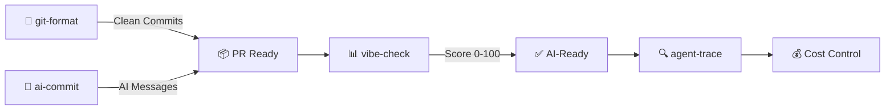

[English](README.md) | [中文](README.zh.md)

<div align="center">


</div>


<!-- BADGES: npm downloads + profile stats -->

<a href="https://www.npmjs.com/package/git-format"></a>
<a href="https://www.npmjs.com/package/ai-commit"></a>
<a href="https://www.npmjs.com/package/agent-trace"></a>
<a href="https://www.npmjs.com/package/vibe-check"></a>

<br/>

<a href="https://github.com/Serennity007"></a>

<a href="https://github.com/Serennity007?tab=repositories"></a>

---

<!-- ABOUT -->

## 👋 About Me

AI researcher & open-source builder. M.S. in Intelligent Science & Technology at **Beijing Institute of Technology** (2026 → ). First-author paper at **CCF-BigData 2025** on legal judgment prediction with LLMs.

- 🔧 **4 npm CLI tools** — `npx`-ready, zero install
- 📦 **324 open-source repos** — all MIT, all free
- 🏆 Huawei ICT Contest **National 1st Prize** (+ Global 3rd) · National Scholarship · Rank **1/69**, GPA **4.14/5**
- 🔬 Legal AI + multimodal safety alignment · 🇸🇬 NUS exchange · IELTS 6.5

---

<!-- QUICK TRY -->

## ⚡ Try One in 10 Seconds

```bash
# Format messy git history → clean Conventional Commits
npx git-format

# AI writes your commit messages
npx ai-commit

# Score your project's AI-readiness (0-100)
npx @liangzhengtao/vibe-check

# Track your AI agent — costs, tokens, tool calls
npx agent-trace
```

**No clone · No API key · No config · Just run it**

---

<!-- WHAT I BUILD -->

## 🔧 What I Build

| Tool | What it does | Try it |
|:-----|:-------------|:-------|
| **[git-format](https://github.com/Serennity007/git-format)** | Format commits to Conventional Commits | `npx git-format` |
| **[ai-commit](https://github.com/Serennity007/ai-commit)** | AI generates commit messages from git diff | `npx ai-commit` |
| **[agent-trace](https://github.com/Serennity007/agent-trace)** | Track AI agent costs, tokens, tool health | `npx agent-trace` |
| **[vibe-check](https://github.com/Serennity007/vibe-check)** | Audit project AI-readiness (0-100 score) | `npx @liangzhengtao/vibe-check` |

### Curated Collections

| Collection | What's inside |
|:-----------|:--------------|
| **[awesome-ai-rules](https://github.com/Serennity007/awesome-ai-rules)** | 20 production AI coding rules for Cursor, Claude, Kimi Code |
| **[awesome-mcp-servers](https://github.com/Serennity007/awesome-mcp-servers)** | 9 verified MCP server configs |
| **[awesome-prompts](https://github.com/Serennity007/awesome-prompts)** | 285+ tested AI prompts for every task |

---

<!-- TECH STACK -->

## 📊 Tech Stack

<div align="center">

<a href="https://skillicons.dev">

</a>

</div>

---

<!-- WORKFLOW -->

## 🔀 How My Tools Work Together



---

<!-- GITHUB STATS -->

## 📈 GitHub Stats

<div align="center">


<br/>


</div>

---

<!-- ACTIVITY -->

## 🐍 Activity

<div align="center">

<picture>
  <source media="(prefers-color-scheme: dark)" srcset="https://cdn.jsdelivr.net/gh/Serennity007/Serennity007@output/github-contribution-grid-snake-dark.svg" />
  <source media="(prefers-color-scheme: light)" srcset="https://cdn.jsdelivr.net/gh/Serennity007/Serennity007@output/github-contribution-grid-snake.svg" />
  
</picture>

</div>

---

<!-- FEATURED PROJECTS -->

<details>
<summary><b>📂 Featured Projects (10 of 324)</b></summary>

| Project | Description |
|:--------|:------------|
| [token-meter](https://github.com/Serennity007/token-meter) | Real-time token & cost meter for AI coding agents |
| [paper-grill](https://github.com/Serennity007/paper-grill) | Honest paper review — NeurIPS / ICML / ICLR styles |
| [awesome-ai-alignment](https://github.com/Serennity007/awesome-ai-alignment) | 12 AI safety & alignment skills |
| [awesome-trading-strategies](https://github.com/Serennity007/awesome-trading-strategies) | 6 practical trading strategies for retail investors |
| [awesome-stock-quant-skills](https://github.com/Serennity007/awesome-stock-quant-skills) | Quant research & trading skill collection |
| [awesome-research-figures](https://github.com/Serennity007/awesome-research-figures) | Publication-quality scientific figures |
| [awesome-ai-agents](https://github.com/Serennity007/awesome-ai-agents) | 12 production-ready AI agent skills |
| [awesome-geo](https://github.com/Serennity007/awesome-geo) | Get recommended by AI search engines (GEO) |
| [awesome-portfolio-skills](https://github.com/Serennity007/awesome-portfolio-skills) | Build a developer portfolio that stands out |
| [build-your-own-x](https://github.com/Serennity007/build-your-own-x) | Build tech from scratch — curated tutorials |

**[Browse all 324 repos →](https://github.com/Serennity007?tab=repositories)**

</details>

---

<!-- CONNECT -->

<div align="center">

### 🤝 Connect

[](https://github.com/Serennity007)
[](mailto:1392452425a@gmail.com)
[](https://serennity007.github.io/liangzhengtao-portfolio/)
[](https://github.com/Serennity007/blog)

**324 repos · All open source · All free**

*If any of these saved you time, ⭐ the repo you used most.*

</div>
