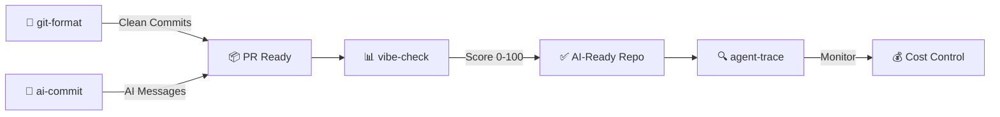

[English](README.md) | [中文](README.zh.md) | [日本語](README.ja.md) | [Français](README.fr.md) | [Español](README.es.md) | [العربية](README.ar.md) | [한국어](README.ko.md) | [Português](README.pt.md) | [Русский](README.ru.md) | [Deutsch](README.de.md)

<div align="center">


### `>_` I build CLI tools that automate the boring parts of AI development

[](https://www.npmjs.com/package/git-format)
[](https://www.npmjs.com/package/ai-commit)
[](https://www.npmjs.com/package/agent-trace)
[](https://github.com/liangzhengtao)

<a href="https://github.com/liangzhengtao?tab=repositories&sort=stargazers">
  
</a>
<a href="https://github.com/liangzhengtao?tab=repositories">
  
</a>
<a href="https://github.com/liangzhengtao?tab=repositories&sort=stargazers">
  
</a>

</div>

---

##  Quick Try

```bash
# 🎯 Format messy git history → clean Conventional Commits
npx git-format

# 🤖 AI writes your commit messages from staged changes
npx ai-commit

# 📊 Score your project's AI-readiness (0-100)
npx @liangzhengtao/vibe-check

# 🔍 Track your AI agent — costs, tokens, tool calls
npx agent-trace
```

<p align="center">
  <b>No clone · No API key · No config · Just run it</b>
</p>

---

##  What I Build

<table>
<tr>
<td width="50%">

### 🔧 Original CLI Tools

| Tool | Try it |
|:-----|:-------|
| **[git-format](https://github.com/liangzhengtao/git-format)** — Conventional Commits | `npx git-format` |
| **[ai-commit](https://github.com/liangzhengtao/ai-commit)** — AI commit messages | `npx ai-commit` |
| **[agent-trace](https://github.com/liangzhengtao/agent-trace)** — Agent monitoring | `npx agent-trace` |
| **[vibe-check](https://github.com/liangzhengtao/vibe-check)** — AI-readiness audit | `npx @liangzhengtao/vibe-check` |

</td>
<td width="50%">

### 📦 Curated Collections

| Collection | Highlights |
|:-----------|:-----------|
| **[awesome-ai-rules](https://github.com/liangzhengtao/awesome-ai-rules)** | 20 production AI coding rules |
| **[awesome-mcp-servers](https://github.com/liangzhengtao/awesome-mcp-servers)** | 9 verified MCP configs |
| **[awesome-prompts](https://github.com/liangzhengtao/awesome-prompts)** | 285+ AI prompts |

</td>
</tr>
</table>

---

##  GitHub Analytics

<div align="center">


</div>

---

##  Tech Stack

<div align="center">


</div>

---

##  Featured Workflow



---

##  All 33 Projects

<details>
<summary><strong>🤖 AI Developer Tools (6)</strong></summary>
<br>

| Project | Description |
|:--------|:------------|
| [agent-trace](https://github.com/liangzhengtao/agent-trace) | 🔍 Track AI agent — costs, tokens, tool health |
| [awesome-ai-rules](https://github.com/liangzhengtao/awesome-ai-rules) | 📏 20 production AI coding rules |
| [vibe-check](https://github.com/liangzhengtao/vibe-check) | 📊 Score project AI-readiness (0-100) |
| [commit-ai](https://github.com/liangzhengtao/ai-commit) | 🤖 AI writes commit messages |
| [awesome-mcp-servers](https://github.com/liangzhengtao/awesome-mcp-servers) | 🔌 9 verified MCP servers |
| [awesome-ai-agents](https://github.com/liangzhengtao/awesome-ai-agents) | 🏗️ 12 production AI agent skills |

</details>

<details>
<summary><strong>📚 Research & Career (7)</strong></summary>
<br>

| Project | Description |
|:--------|:------------|
| [awesome-skills](https://github.com/liangzhengtao/awesome-skills) | 🔬 12 research skills (LaTeX, stats) |
| [awesome-research-figures](https://github.com/liangzhengtao/awesome-research-figures) | 📈 Publication-quality scientific figures |
| [awesome-interview-skills](https://github.com/liangzhengtao/awesome-interview-skills) | 💼 14 skills to land your dream job |
| [system-design-interview](https://github.com/liangzhengtao/system-design-interview) | 🏛️ System design prep with ASCII diagrams |
| [awesome-developer-roadmap](https://github.com/liangzhengtao/awesome-developer-roadmap) | 🗺️ 10 career roadmaps (junior → staff) |
| [build-your-own-x-cn](https://github.com/liangzhengtao/build-your-own-x-cn) | 🛠️ Build tech from scratch (10 tutorials) |
| [leetcode-patterns-cn](https://github.com/liangzhengtao/leetcode-patterns-cn) | 🧩 8 algorithm patterns, 72 problems |

</details>

<details>
<summary><strong>🎬 Video & Creative (7)</strong></summary>
<br>

| Project | Description |
|:--------|:------------|
| [awesome-video-prompts](https://github.com/liangzhengtao/awesome-video-prompts) | 🎥 200+ prompts (Sora, Runway, Kling) |
| [awesome-video-to-text](https://github.com/liangzhengtao/awesome-video-to-text) | 📝 12 transcription skills |
| [awesome-video-creation](https://github.com/liangzhengtao/awesome-video-creation) | 🎬 14 video workflow skills |
| [awesome-video-skills](https://github.com/liangzhengtao/awesome-video-skills) | ✂️ 10 video editing skills |
| [awesome-creative-skills](https://github.com/liangzhengtao/awesome-creative-skills) | 🎨 10 creative skills (posters, logos) |
| [awesome-writing-skills](https://github.com/liangzhengtao/awesome-writing-skills) | ✍️ 12 writing skills (blog, SEO) |
| [awesome-prompts](https://github.com/liangzhengtao/awesome-prompts) | 💡 285+ AI prompts for every task |

</details>

<details>
<summary><strong>🛠️ Developer Resources (8)</strong></summary>
<br>

| Project | Description |
|:--------|:------------|
| [awesome-dev-tools](https://github.com/liangzhengtao/awesome-dev-tools) | 🧰 50+ developer tools by category |
| [awesome-devops-skills](https://github.com/liangzhengtao/awesome-devops-skills) | 🚀 12 DevOps skills (CI/CD, K8s) |
| [awesome-security-skills](https://github.com/liangzhengtao/awesome-security-skills) | 🔒 12 cybersecurity skills |
| [awesome-startup-skills](https://github.com/liangzhengtao/awesome-startup-skills) | 🚀 12 skills for founders |
| [ai-agent-architectures](https://github.com/liangzhengtao/ai-agent-architectures) | 🏗️ 7 AI agent patterns |
| [open-source-llm-guide](https://github.com/liangzhengtao/open-source-llm-guide) | 🧠 Run LLMs on your own hardware |
| [github-stars-analysis](https://github.com/liangzhengtao/github-stars-analysis) | ⭐ GitHub star trends analysis |
| [awesome-chinese-developer-tools](https://github.com/liangzhengtao/awesome-chinese-developer-tools) | 🇨🇳 Chinese developer tools |

</details>

<details>
<summary><strong>📁 Personal (4)</strong></summary>
<br>

| Project | Description |
|:--------|:------------|
| [my-dotfiles](https://github.com/liangzhengtao/my-dotfiles) | ⚙️ My dev environment (Zsh, Git, Neovim) |
| [guizhou-exam-papers](https://github.com/liangzhengtao/guizhou-exam-papers) | 📖 Guizhou exam papers (free for students) |
| [blog](https://github.com/liangzhengtao/blog) | 📝 Technical blog posts |
| [git-format](https://github.com/liangzhengtao/git-format) | 🔧 Format commits to Conventional Commits |

</details>

---

<div align="center">

### 🤝 Connect

[](https://github.com/liangzhengtao)
[](https://github.com/liangzhengtao/blog)

### 💝 Support

If any of these saved you time, give the repo you used most a ⭐

<br>


</div>
