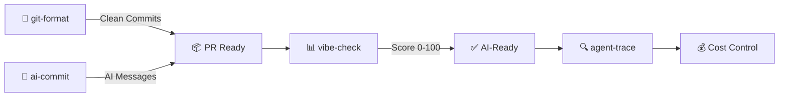

[English](README.md) | [中文](README.zh.md) | [日本語](README.ja.md) | [Français](README.fr.md) | [Español](README.es.md) | [العربية](README.ar.md) | [한국어](README.ko.md) | [Português](README.pt.md) | [Русский](README.ru.md) | [Deutsch](README.de.md)

<!-- ═══════════════════════════════════════════════════════════════ -->
<!-- HEADER: Animated Terminal                                       -->
<!-- ═══════════════════════════════════════════════════════════════ -->

<div align="center">


</div>


<br/>

<!-- ═══════════════════════════════════════════════════════════════ -->
<!-- BADGES: npm downloads + profile stats                           -->
<!-- ═══════════════════════════════════════════════════════════════ -->

<a href="https://www.npmjs.com/package/git-format"></a>
<a href="https://www.npmjs.com/package/ai-commit"></a>
<a href="https://www.npmjs.com/package/agent-trace"></a>
<a href="https://www.npmjs.com/package/vibe-check"></a>

<br/>

<a href="https://github.com/liangzhengtao"></a>

<a href="https://github.com/liangzhengtao?tab=repositories"></a>

</div>

---

<!-- ═══════════════════════════════════════════════════════════════ -->
<!-- ABOUT ME                                                        -->
<!-- ═══════════════════════════════════════════════════════════════ -->

## 👋 About Me

I'm a developer focused on building AI-powered CLI tools. My tools help developers with:
- **Git workflows** — auto-format commits, AI-generated messages
- **AI agent monitoring** — track costs, tokens, tool health
- **Project auditing** — score AI-readiness of your codebase

All tools are open source, MIT licensed, and can be run with `npx` — zero install required.

---

<!-- ═══════════════════════════════════════════════════════════════ -->
<!-- QUICK TRY: Terminal Demo                                        -->
<!-- ═══════════════════════════════════════════════════════════════ -->

## ⚡ Try One in 10 Seconds

```bash
# Format messy git history → clean Conventional Commits
npx git-format

# AI writes your commit messages
npx ai-commit

# Score your project's AI-readiness (0-100)
npx @liangzhengtao/vibe-check

# Track your AI agent — costs, tokens, tool calls
npx agent-trace
```

**No clone · No API key · No config · Just run it**

---

<!-- ═══════════════════════════════════════════════════════════════ -->
<!-- WHAT I BUILD                                                    -->
<!-- ═══════════════════════════════════════════════════════════════ -->

## 🔧 What I Build

### Original CLI Tools

| Tool | What it does | Try it |
|:-----|:-------------|:-------|
| **[git-format](https://github.com/liangzhengtao/git-format)** | Format commits to Conventional Commits | `npx git-format` |
| **[ai-commit](https://github.com/liangzhengtao/ai-commit)** | AI generates commit messages from git diff | `npx ai-commit` |
| **[agent-trace](https://github.com/liangzhengtao/agent-trace)** | Track AI agent costs, tokens, tool health | `npx agent-trace` |
| **[vibe-check](https://github.com/liangzhengtao/vibe-check)** | Audit project AI-readiness (0-100 score) | `npx @liangzhengtao/vibe-check` |

### Curated Collections

| Collection | What's inside |
|:-----------|:--------------|
| **[awesome-ai-rules](https://github.com/liangzhengtao/awesome-ai-rules)** | 20 production AI coding rules for Cursor, Claude, Kimi Code |
| **[awesome-mcp-servers](https://github.com/liangzhengtao/awesome-mcp-servers)** | 9 verified MCP server configs |
| **[awesome-prompts](https://github.com/liangzhengtao/awesome-prompts)** | 285+ tested AI prompts for every task |

---

<!-- ═══════════════════════════════════════════════════════════════ -->
<!-- TECH STACK: Animated Skill Icons                                -->
<!-- ═══════════════════════════════════════════════════════════════ -->

## 📊 Tech Stack

<div align="center">

<a href="https://skillicons.dev">

</a>

</div>

---

<!-- ═══════════════════════════════════════════════════════════════ -->
<!-- WORKFLOW: Mermaid Diagram                                        -->
<!-- ═══════════════════════════════════════════════════════════════ -->

## 🔀 How My Tools Work Together



---

<!-- ═══════════════════════════════════════════════════════════════ -->
<!-- GITHUB STATS: Animated Cards                                    -->
<!-- ═══════════════════════════════════════════════════════════════ -->

## 📈 GitHub Stats

<div align="center">


<br/>


</div>

---

<!-- ═══════════════════════════════════════════════════════════════ -->
<!-- ACTIVITY GRAPH                                                  -->
<!-- ═══════════════════════════════════════════════════════════════ -->

## 🔥 Activity

<div align="center">


</div>

---

<!-- ═══════════════════════════════════════════════════════════════ -->
<!-- ALL PROJECTS                                                    -->
<!-- ═══════════════════════════════════════════════════════════════ -->

## 📂 All Projects (300+)

<details>
<summary><b>🤖 AI Developer Tools (6)</b></summary>

| Project | Description |
|:--------|:------------|
| [agent-trace](https://github.com/liangzhengtao/agent-trace) | Track AI agent — costs, tokens, tool health |
| [awesome-ai-rules](https://github.com/liangzhengtao/awesome-ai-rules) | 20 production AI coding rules |
| [vibe-check](https://github.com/liangzhengtao/vibe-check) | Score project AI-readiness (0-100) |
| [commit-ai](https://github.com/liangzhengtao/ai-commit) | AI writes commit messages |
| [awesome-mcp-servers](https://github.com/liangzhengtao/awesome-mcp-servers) | 9 verified MCP servers |
| [awesome-ai-agents](https://github.com/liangzhengtao/awesome-ai-agents) | 12 production AI agent skills |

</details>

<details>
<summary><b>📚 Research & Career (7)</b></summary>

| Project | Description |
|:--------|:------------|
| [awesome-skills](https://github.com/liangzhengtao/awesome-skills) | 12 research skills (LaTeX, stats) |
| [awesome-research-figures](https://github.com/liangzhengtao/awesome-research-figures) | Publication-quality scientific figures |
| [awesome-interview-skills](https://github.com/liangzhengtao/awesome-interview-skills) | 14 skills to land your dream job |
| [system-design-interview](https://github.com/liangzhengtao/system-design-interview) | System design prep with ASCII diagrams |
| [awesome-developer-roadmap](https://github.com/liangzhengtao/awesome-developer-roadmap) | 10 career roadmaps (junior → staff) |
| [build-your-own-x-cn](https://github.com/liangzhengtao/build-your-own-x-cn) | Build tech from scratch (10 tutorials) |
| [leetcode-patterns-cn](https://github.com/liangzhengtao/leetcode-patterns-cn) | 8 algorithm patterns, 72 problems |

</details>

<details>
<summary><b>🎬 Video & Creative (7)</b></summary>

| Project | Description |
|:--------|:------------|
| [awesome-video-prompts](https://github.com/liangzhengtao/awesome-video-prompts) | 200+ prompts (Sora, Runway, Kling) |
| [awesome-video-to-text](https://github.com/liangzhengtao/awesome-video-to-text) | 12 transcription skills |
| [awesome-video-creation](https://github.com/liangzhengtao/awesome-video-creation) | 14 video workflow skills |
| [awesome-video-skills](https://github.com/liangzhengtao/awesome-video-skills) | 10 video editing skills |
| [awesome-creative-skills](https://github.com/liangzhengtao/awesome-creative-skills) | 10 creative skills (posters, logos) |
| [awesome-writing-skills](https://github.com/liangzhengtao/awesome-writing-skills) | 12 writing skills (blog, SEO) |
| [awesome-prompts](https://github.com/liangzhengtao/awesome-prompts) | 285+ AI prompts for every task |

</details>

<details>
<summary><b>🛠️ Developer Resources (8)</b></summary>

| Project | Description |
|:--------|:------------|
| [awesome-dev-tools](https://github.com/liangzhengtao/awesome-dev-tools) | 50+ developer tools by category |
| [awesome-devops-skills](https://github.com/liangzhengtao/awesome-devops-skills) | 12 DevOps skills (CI/CD, K8s) |
| [awesome-security-skills](https://github.com/liangzhengtao/awesome-security-skills) | 12 cybersecurity skills |
| [awesome-startup-skills](https://github.com/liangzhengtao/awesome-startup-skills) | 12 skills for founders |
| [ai-agent-architectures](https://github.com/liangzhengtao/ai-agent-architectures) | 7 AI agent patterns |
| [open-source-llm-guide](https://github.com/liangzhengtao/open-source-llm-guide) | Run LLMs on your own hardware |
| [github-stars-analysis](https://github.com/liangzhengtao/github-stars-analysis) | GitHub star trends analysis |
| [awesome-chinese-developer-tools](https://github.com/liangzhengtao/awesome-chinese-developer-tools) | Chinese developer tools |

</details>

<details>
<summary><b>📁 Personal (4)</b></summary>

| Project | Description |
|:--------|:------------|
| [my-dotfiles](https://github.com/liangzhengtao/my-dotfiles) | Dev environment (Zsh, Git, Neovim) |
| [guizhou-exam-papers](https://github.com/liangzhengtao/guizhou-exam-papers) | Guizhou exam papers (free for students) |
| [blog](https://github.com/liangzhengtao/blog) | Technical blog posts |
| [git-format](https://github.com/liangzhengtao/git-format) | Format commits to Conventional Commits |

</details>

---

<!-- ═══════════════════════════════════════════════════════════════ -->
<!-- FOOTER                                                          -->
<!-- ═══════════════════════════════════════════════════════════════ -->

<div align="center">

### 🤝 Connect

[](https://github.com/liangzhengtao)
[](https://github.com/liangzhengtao/blog)

**300+ projects · All open source · All free**

*If any of these saved you time, ⭐ the repo you used most.*

</div>
