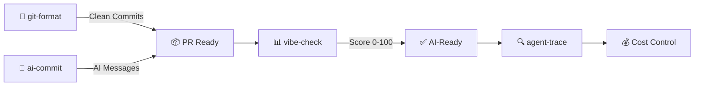

[English](README.md) | [中文](README.zh.md)

<div align="center">


</div>


<!-- BADGES: npm downloads + profile stats -->

<a href="https://www.npmjs.com/package/@liangzhengtao/git-format"></a>
<a href="https://www.npmjs.com/package/@liangzhengtao/commit-ai"></a>
<a href="https://www.npmjs.com/package/@liangzhengtao/agent-trace"></a>
<a href="https://www.npmjs.com/package/@liangzhengtao/vibe-check"></a>

<br/>

<a href="https://github.com/Serennity007"></a>

<a href="https://github.com/Serennity007?tab=repositories"></a>

---

<!-- ABOUT -->

## 👋 About Me

AI researcher & open-source builder. M.S. in Intelligent Science & Technology at **Beijing Institute of Technology** (2026 → ). First-author paper at **CCF-BigData 2025** on legal judgment prediction with LLMs.

- 🔧 **4 npm CLI tools** — `npx`-ready, zero install
- 📦 **325 open-source repos** — all MIT, all free
- 🏆 Huawei ICT Contest **National 1st Prize** (+ Global 3rd) · National Scholarship · Rank **1/69**, GPA **4.14/5**
- 🔬 Legal AI + multimodal safety alignment · 🇸🇬 NUS exchange · IELTS 6.5

---

<!-- QUICK TRY -->

## ⚡ Try One in 10 Seconds

```bash
# Format messy git history → clean Conventional Commits
npx @liangzhengtao/git-format

# AI writes your commit messages
npx @liangzhengtao/commit-ai

# Score your project's AI-readiness (0-100)
npx @liangzhengtao/vibe-check

# Track your AI agent — costs, tokens, tool calls
npx @liangzhengtao/agent-trace
```

**No clone · No API key · No config · Just run it**

---

<!-- WHAT I BUILD -->

## 🔧 What I Build

| Tool | What it does | Try it |
|:-----|:-------------|:-------|
| **[git-format](https://github.com/Serennity007/git-format)** | Format commits to Conventional Commits | `npx @liangzhengtao/git-format` |
| **[ai-commit](https://github.com/Serennity007/ai-commit)** | AI generates commit messages from git diff | `npx @liangzhengtao/commit-ai` |
| **[agent-trace](https://github.com/Serennity007/agent-trace)** | Track AI agent costs, tokens, tool health | `npx @liangzhengtao/agent-trace` |
| **[vibe-check](https://github.com/Serennity007/vibe-check)** | Audit project AI-readiness (0-100 score) | `npx @liangzhengtao/vibe-check` |

### Curated Collections

| Collection | What's inside |
|:-----------|:--------------|
| **[awesome-ai-rules](https://github.com/Serennity007/awesome-ai-rules)** | 20 production AI coding rules for Cursor, Claude, Kimi Code |
| **[awesome-mcp-servers](https://github.com/Serennity007/awesome-mcp-servers)** | 9 verified MCP server configs |
| **[awesome-prompts](https://github.com/Serennity007/awesome-prompts)** | 285+ tested AI prompts for every task |

---

<!-- NEW: INVESTMENT MASTERS SKILLS -->

## 🎓 New: Investment Masters × AI Skills

**[awesome-stock-quant-skills](https://github.com/Serennity007/awesome-stock-quant-skills)** — legendary investors' methodologies as runnable AI skills (akshare data, Claude Code ready, 中文/EN/日本語 docs). 16 curated + **23 original** skills, incl. 5 Chinese investment masters.

| Master | Skill | One-liner |
|:-------|:------|:----------|
| Buffett | [buffett-value-investing](https://github.com/Serennity007/awesome-stock-quant-skills/tree/main/my-skills/buffett-value-investing) | Moat + 5yr ROE + margin of safety |
| Munger | [munger-quality-investing](https://github.com/Serennity007/awesome-stock-quant-skills/tree/main/my-skills/munger-quality-investing) | Great company at fair price, 5-dim quality score |
| Lynch | [lynch-garp-investing](https://github.com/Serennity007/awesome-stock-quant-skills/tree/main/my-skills/lynch-garp-investing) | PEG<1 tenbagger screen + 6-type tagging |
| Graham | [graham-defensive-investing](https://github.com/Serennity007/awesome-stock-quant-skills/tree/main/my-skills/graham-defensive-investing) | Defensive 7-criteria gate |
| Dalio | [dalio-all-weather](https://github.com/Serennity007/awesome-stock-quant-skills/tree/main/my-skills/dalio-all-weather) | All-weather risk parity + backtest |
| Marks | [howard-marks-cycle](https://github.com/Serennity007/awesome-stock-quant-skills/tree/main/my-skills/howard-marks-cycle) | 0-100 market cycle thermometer |
| Soros | [soros-reflexivity](https://github.com/Serennity007/awesome-stock-quant-skills/tree/main/my-skills/soros-reflexivity) | Reflexivity: price-fundamentals divergence scan |
| Druckenmiller | [druckenmiller-macro-flex](https://github.com/Serennity007/awesome-stock-quant-skills/tree/main/my-skills/druckenmiller-macro-flex) | Macro dashboard: FX / rates / gold / oil / copper |
| Livermore | [livermore-trend-trading](https://github.com/Serennity007/awesome-stock-quant-skills/tree/main/my-skills/livermore-trend-trading) | Pivotal-point breakout + pyramid sizing |
| Simons | [simons-factor-quant](https://github.com/Serennity007/awesome-stock-quant-skills/tree/main/my-skills/simons-factor-quant) | Multi-factor scorer: momentum / reversal / volatility / volume / MA deviation |
| Klarman | [klarman-margin-safety](https://github.com/Serennity007/awesome-stock-quant-skills/tree/main/my-skills/klarman-margin-safety) | Deep value: PB/PE percentiles, net cash, 52w drawdown |
| Templeton | [templeton-global-contrarian](https://github.com/Serennity007/awesome-stock-quant-skills/tree/main/my-skills/templeton-global-contrarian) | Max-pessimism scan: 52w low zone + historic valuation lows |
| Fisher | [fisher-growth-15](https://github.com/Serennity007/awesome-stock-quant-skills/tree/main/my-skills/fisher-growth-15) | Growth-stock 15 points: R&D intensity + margin trend + scuttlebutt shortlist |
| Neff | [neff-low-pe-total-return](https://github.com/Serennity007/awesome-stock-quant-skills/tree/main/my-skills/neff-low-pe-total-return) | Low P/E vs market median + total-return ratio ≥2 golden standard |
| Duan Yongping | [duan-yongping-business-first](https://github.com/Serennity007/awesome-stock-quant-skills/tree/main/my-skills/duan-yongping-business-first) | Business model first: 6-dim screen, "dare to be the follower" |
| Zhang Lei | [zhang-lei-longterm](https://github.com/Serennity007/awesome-stock-quant-skills/tree/main/my-skills/zhang-lei-longterm) | Long-term structural value: 4-d growth-quality radar |
| Qiu Guolu | [qiu-guolu-simple-rules](https://github.com/Serennity007/awesome-stock-quant-skills/tree/main/my-skills/qiu-guolu-simple-rules) | Good industry/company/price — "count moons, not stars" |
| Feng Liu | [feng-liu-weak-side](https://github.com/Serennity007/awesome-stock-quant-skills/tree/main/my-skills/feng-liu-weak-side) | Weak-side contrarian: high odds after deep drawdowns |
| Lin Yuan | [lin-yuan-monopoly-consumer](https://github.com/Serennity007/awesome-stock-quant-skills/tree/main/my-skills/lin-yuan-monopoly-consumer) | Monopoly + addictive consumer: mouth-related necessities |

Plus the ⚡ hot-theme series: [hot-theme-scanner](https://github.com/Serennity007/awesome-stock-quant-skills/tree/main/my-skills/hot-theme-scanner) · [us-hot-stocks-tracker](https://github.com/Serennity007/awesome-stock-quant-skills/tree/main/my-skills/us-hot-stocks-tracker) · [concept-stock-mapper](https://github.com/Serennity007/awesome-stock-quant-skills/tree/main/my-skills/concept-stock-mapper) · [technical-pattern-recognition](https://github.com/Serennity007/awesome-stock-quant-skills/tree/main/my-skills/technical-pattern-recognition)

---

<!-- TECH STACK -->

## 📊 Tech Stack

<div align="center">

<a href="https://skillicons.dev">

</a>

</div>

---

<!-- WORKFLOW -->

## 🔀 How My Tools Work Together



---

<!-- GITHUB STATS -->

## 📈 GitHub Stats

<div align="center">


<br/>


</div>

---

<!-- ACTIVITY -->

## 🐍 Activity

<div align="center">

<picture>
  <source media="(prefers-color-scheme: dark)" srcset="https://cdn.jsdelivr.net/gh/Serennity007/Serennity007@output/animal-snake-dark.svg" />
  <source media="(prefers-color-scheme: light)" srcset="https://cdn.jsdelivr.net/gh/Serennity007/Serennity007@output/animal-snake.svg" />
  
</picture>

</div>

---

<!-- FEATURED PROJECTS -->

<details>
<summary><b>📂 Featured Projects (10 of 325)</b></summary>

| Project | Description |
|:--------|:------------|
| [token-meter](https://github.com/Serennity007/token-meter) | Real-time token & cost meter for AI coding agents |
| [paper-grill](https://github.com/Serennity007/paper-grill) | Honest paper review — NeurIPS / ICML / ICLR styles |
| [awesome-ai-alignment](https://github.com/Serennity007/awesome-ai-alignment) | 12 AI safety & alignment skills |
| [awesome-trading-strategies](https://github.com/Serennity007/awesome-trading-strategies) | 6 practical trading strategies for retail investors |
| [awesome-stock-quant-skills](https://github.com/Serennity007/awesome-stock-quant-skills) | Quant research & trading skill collection |
| [awesome-research-figures](https://github.com/Serennity007/awesome-research-figures) | Publication-quality scientific figures |
| [awesome-ai-agents](https://github.com/Serennity007/awesome-ai-agents) | 12 production-ready AI agent skills |
| [awesome-geo](https://github.com/Serennity007/awesome-geo) | Get recommended by AI search engines (GEO) |
| [awesome-portfolio-skills](https://github.com/Serennity007/awesome-portfolio-skills) | Build a developer portfolio that stands out |
| [build-your-own-x](https://github.com/Serennity007/build-your-own-x) | Build tech from scratch — curated tutorials |

**[Browse all 325 repos →](https://github.com/Serennity007?tab=repositories)**

</details>

---

<!-- CONNECT -->

<div align="center">

### 🤝 Connect

[](https://github.com/Serennity007)
[](mailto:1392452425a@gmail.com)
[](https://serennity007.github.io/Serennity007-portfolio/)
[](https://github.com/Serennity007/blog)

**325 repos · All open source · All free**

*If any of these saved you time, ⭐ the repo you used most.*

</div>

---

<!-- FOOTER -->

<div align="center">


</div>
