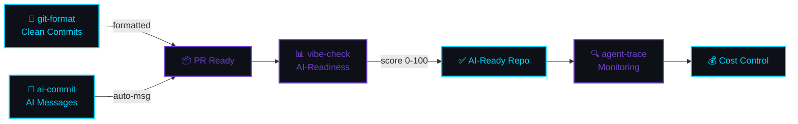

[English](README.md) | [中文](README.zh.md) | [日本語](README.ja.md) | [Français](README.fr.md) | [Español](README.es.md) | [العربية](README.ar.md) | [한국어](README.ko.md) | [Português](README.pt.md) | [Русский](README.ru.md) | [Deutsch](README.de.md)

<!-- ██████████████████████████████████████████████████████████████████████████████████ -->
<!-- ██  HEADER: Cyberpunk Terminal                                              ██ -->
<!-- ██████████████████████████████████████████████████████████████████████████████████ -->


<div align="center">

```
 ███████╗██╗  ██╗███████╗███╗   ██╗ ██████╗ ████████╗ █████╗  ██████╗ 
 ╚══██╔╝██║  ██║██╔════╝████╗  ██║██╔═══██╗╚══██╔══╝██╔══██╗██╔═══██╗
    ██║ ███████║█████╗  ██╔██╗ ██║██║   ██║   ██║   ███████║██║   ██║
    ██║ ██╔══██║██╔══╝  ██║╚██╗██║██║   ██║   ██║   ██╔══██║██║   ██║
    ██║ ██║  ██║███████╗██║ ╚████║╚██████╔╝   ██║   ██║  ██║╚██████╔╝
    ╚═╝ ╚═╝  ╚═╝╚══════╝╚═╝  ╚═══╝ ╚═════╝    ╚═╝   ╚═╝  ╚═╝ ╚═════╝
```


<br/>

<!-- ═══════════ BADGES ═══════════ -->
<a href="https://www.npmjs.com/package/git-format"></a>
<a href="https://www.npmjs.com/package/ai-commit"></a>
<a href="https://www.npmjs.com/package/agent-trace"></a>
<a href="https://www.npmjs.com/package/vibe-check"></a>

<a href="https://github.com/liangzhengtao"></a>

<a href="https://github.com/liangzhengtao?tab=repositories"></a>

</div>

---

<!-- ██████████████████████████████████████████████████████████████████████████████████ -->
<!-- ██  TERMINAL DEMO                                                           ██ -->
<!-- ██████████████████████████████████████████████████████████████████████████████████ -->

<div align="center">

```
┌──────────────────────────────────────────────────────────────────────┐
│  $ npx git-format                                                    │
│  ✓ feat(auth): add login validation                                  │
│                                                                      │
│  $ npx ai-commit                                                     │
│  ✓ fix(api): handle null response in user endpoint                   │
│                                                                      │
│  $ npx @liangzhengtao/vibe-check                                     │
│  ┌────────────────────────────────────────────────────────────────┐  │
│  │ ✨ Score: 83/100 │ Grade: A                                    │  │
│  │ Great! Your project is very AI-friendly.                       │  │
│  └────────────────────────────────────────────────────────────────┘  │
│                                                                      │
│  $ npx agent-trace                                                   │
│  📊 Sessions: 64 │ Cost: $4681 │ Tokens: 2.3B                       │
│                                                                      │
│  No clone · No API key · No config · Just run it                     │
└──────────────────────────────────────────────────────────────────────┘
```

</div>

---

<!-- ██████████████████████████████████████████████████████████████████████████████████ -->
<!-- ██  WHAT I BUILD                                                            ██ -->
<!-- ██████████████████████████████████████████████████████████████████████████████████ -->

<div align="center">

### `>_` WHAT I BUILD

</div>

<table>
<tr>
<td width="50%" valign="top">

#### 🔧 Original CLI Tools

| Tool | Command |
|:-----|:--------|
| **[git-format](https://github.com/liangzhengtao/git-format)** — Conventional Commits | `npx git-format` |
| **[ai-commit](https://github.com/liangzhengtao/ai-commit)** — AI commit messages | `npx ai-commit` |
| **[agent-trace](https://github.com/liangzhengtao/agent-trace)** — Agent monitoring | `npx agent-trace` |
| **[vibe-check](https://github.com/liangzhengtao/vibe-check)** — AI-readiness audit | `npx @liangzhengtao/vibe-check` |

</td>
<td width="50%" valign="top">

#### 📦 Curated Collections

| Collection | Highlights |
|:-----------|:-----------|
| **[awesome-ai-rules](https://github.com/liangzhengtao/awesome-ai-rules)** | 20 production AI coding rules |
| **[awesome-mcp-servers](https://github.com/liangzhengtao/awesome-mcp-servers)** | 9 verified MCP configs |
| **[awesome-prompts](https://github.com/liangzhengtao/awesome-prompts)** | 285+ AI prompts |

</td>
</tr>
</table>

---

<!-- ██████████████████████████████████████████████████████████████████████████████████ -->
<!-- ██  GITHUB TROPHIES                                                         ██ -->
<!-- ██████████████████████████████████████████████████████████████████████████████████ -->

<div align="center">

### `>_` ACHIEVEMENTS


</div>

---

<!-- ██████████████████████████████████████████████████████████████████████████████████ -->
<!-- ██  ANALYTICS                                                                ██ -->
<!-- ██████████████████████████████████████████████████████████████████████████████████ -->

<div align="center">

### `>_` ANALYTICS


<br/>


</div>

---

<!-- ██████████████████████████████████████████████████████████████████████████████████ -->
<!-- ██  ACTIVITY GRAPH                                                           ██ -->
<!-- ██████████████████████████████████████████████████████████████████████████████████ -->

<div align="center">

### `>_` ACTIVITY


</div>

---

<!-- ██████████████████████████████████████████████████████████████████████████████████ -->
<!-- ██  TECH STACK                                                               ██ -->
<!-- ██████████████████████████████████████████████████████████████████████████████████ -->

<div align="center">

### `>_` TECH STACK

<!-- Languages -->


<!-- AI/ML -->


<!-- Frontend -->


<!-- Backend -->


<!-- DevOps -->


<!-- Tools -->


</div>

---

<!-- ██████████████████████████████████████████████████████████████████████████████████ -->
<!-- ██  WORKFLOW                                                                 ██ -->
<!-- ██████████████████████████████████████████████████████████████████████████████████ -->

<div align="center">

### `>_` WORKFLOW

</div>



---

<!-- ██████████████████████████████████████████████████████████████████████████████████ -->
<!-- ██  STAR HISTORY                                                             ██ -->
<!-- ██████████████████████████████████████████████████████████████████████████████████ -->

<div align="center">

### `>_` STAR HISTORY

<a href="https://star-history.com/#liangzhengtao/git-format&liangzhengtao/agent-trace&liangzhengtao/ai-commit&Date">
  
</a>

</div>

---

<!-- ██████████████████████████████████████████████████████████████████████████████████ -->
<!-- ██  ALL PROJECTS                                                             ██ -->
<!-- ██████████████████████████████████████████████████████████████████████████████████ -->

<div align="center">

### `>_` ALL PROJECTS `33`

</div>

<details>
<summary><b> AI Developer Tools (6)</b></summary>
<br>

| Project | Description |
|:--------|:------------|
| [agent-trace](https://github.com/liangzhengtao/agent-trace) | Track AI agent — costs, tokens, tool health |
| [awesome-ai-rules](https://github.com/liangzhengtao/awesome-ai-rules) | 20 production AI coding rules |
| [vibe-check](https://github.com/liangzhengtao/vibe-check) | Score project AI-readiness (0-100) |
| [commit-ai](https://github.com/liangzhengtao/ai-commit) | AI writes commit messages |
| [awesome-mcp-servers](https://github.com/liangzhengtao/awesome-mcp-servers) | 9 verified MCP servers |
| [awesome-ai-agents](https://github.com/liangzhengtao/awesome-ai-agents) | 12 production AI agent skills |

</details>

<details>
<summary><b> Research & Career (7)</b></summary>
<br>

| Project | Description |
|:--------|:------------|
| [awesome-skills](https://github.com/liangzhengtao/awesome-skills) | 12 research skills (LaTeX, stats) |
| [awesome-research-figures](https://github.com/liangzhengtao/awesome-research-figures) | Publication-quality scientific figures |
| [awesome-interview-skills](https://github.com/liangzhengtao/awesome-interview-skills) | 14 skills to land your dream job |
| [system-design-interview](https://github.com/liangzhengtao/system-design-interview) | System design prep with ASCII diagrams |
| [awesome-developer-roadmap](https://github.com/liangzhengtao/awesome-developer-roadmap) | 10 career roadmaps (junior → staff) |
| [build-your-own-x-cn](https://github.com/liangzhengtao/build-your-own-x-cn) | Build tech from scratch (10 tutorials) |
| [leetcode-patterns-cn](https://github.com/liangzhengtao/leetcode-patterns-cn) | 8 algorithm patterns, 72 problems |

</details>

<details>
<summary><b> Video & Creative (7)</b></summary>
<br>

| Project | Description |
|:--------|:------------|
| [awesome-video-prompts](https://github.com/liangzhengtao/awesome-video-prompts) | 200+ prompts (Sora, Runway, Kling) |
| [awesome-video-to-text](https://github.com/liangzhengtao/awesome-video-to-text) | 12 transcription skills |
| [awesome-video-creation](https://github.com/liangzhengtao/awesome-video-creation) | 14 video workflow skills |
| [awesome-video-skills](https://github.com/liangzhengtao/awesome-video-skills) | 10 video editing skills |
| [awesome-creative-skills](https://github.com/liangzhengtao/awesome-creative-skills) | 10 creative skills (posters, logos) |
| [awesome-writing-skills](https://github.com/liangzhengtao/awesome-writing-skills) | 12 writing skills (blog, SEO) |
| [awesome-prompts](https://github.com/liangzhengtao/awesome-prompts) | 285+ AI prompts for every task |

</details>

<details>
<summary><b> Developer Resources (8)</b></summary>
<br>

| Project | Description |
|:--------|:------------|
| [awesome-dev-tools](https://github.com/liangzhengtao/awesome-dev-tools) | 50+ developer tools by category |
| [awesome-devops-skills](https://github.com/liangzhengtao/awesome-devops-skills) | 12 DevOps skills (CI/CD, K8s) |
| [awesome-security-skills](https://github.com/liangzhengtao/awesome-security-skills) | 12 cybersecurity skills |
| [awesome-startup-skills](https://github.com/liangzhengtao/awesome-startup-skills) | 12 skills for founders |
| [ai-agent-architectures](https://github.com/liangzhengtao/ai-agent-architectures) | 7 AI agent patterns |
| [open-source-llm-guide](https://github.com/liangzhengtao/open-source-llm-guide) | Run LLMs on your own hardware |
| [github-stars-analysis](https://github.com/liangzhengtao/github-stars-analysis) | GitHub star trends analysis |
| [awesome-chinese-developer-tools](https://github.com/liangzhengtao/awesome-chinese-developer-tools) | Chinese developer tools |

</details>

<details>
<summary><b> Personal (4)</b></summary>
<br>

| Project | Description |
|:--------|:------------|
| [my-dotfiles](https://github.com/liangzhengtao/my-dotfiles) | Dev environment (Zsh, Git, Neovim) |
| [guizhou-exam-papers](https://github.com/liangzhengtao/guizhou-exam-papers) | Guizhou exam papers (free for students) |
| [blog](https://github.com/liangzhengtao/blog) | Technical blog posts |
| [git-format](https://github.com/liangzhengtao/git-format) | Format commits to Conventional Commits |

</details>

---

<!-- ██████████████████████████████████████████████████████████████████████████████████ -->
<!-- ██  FOOTER                                                                   ██ -->
<!-- ██████████████████████████████████████████████████████████████████████████████████ -->

<div align="center">

### `>_` CONNECT

[](https://github.com/liangzhengtao)
[](https://github.com/liangzhengtao/blog)

<br/>

**60+ projects · All open source · All free**

*If any of these saved you time, ⭐ the repo you used most.*

<br/>


</div>
