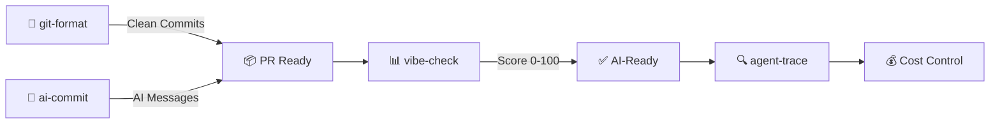

[English](README.md) | [中文](README.zh.md) | [日本語](README.ja.md) | [Français](README.fr.md) | [Español](README.es.md) | [العربية](README.ar.md) | [한국어](README.ko.md) | [Português](README.pt.md) | [Русский](README.ru.md) | [Deutsch](README.de.md)

<!-- ═══════════════════════════════════════════════════════════════ -->
<!-- HEADER: Animated Terminal                                       -->
<!-- ═══════════════════════════════════════════════════════════════ -->

<div align="center">


</div>


<br/>

<!-- ═══════════════════════════════════════════════════════════════ -->
<!-- BADGES: npm downloads + profile stats                           -->
<!-- ═══════════════════════════════════════════════════════════════ -->

<a href="https://www.npmjs.com/package/git-format"></a>
<a href="https://www.npmjs.com/package/ai-commit"></a>
<a href="https://www.npmjs.com/package/agent-trace"></a>
<a href="https://www.npmjs.com/package/vibe-check"></a>

<br/>

<a href="https://github.com/liangzhengtao"></a>

<a href="https://github.com/liangzhengtao?tab=repositories"></a>

</div>

---

<!-- ═══════════════════════════════════════════════════════════════ -->
<!-- ABOUT ME                                                        -->
<!-- ═══════════════════════════════════════════════════════════════ -->

## 👋 Sobre mim

Sou um desenvolvedor focado em construir ferramentas CLI impulsionadas por IA. Minhas ferramentas ajudam desenvolvedores com:
- **Workflows de Git** — formatação automática de commits, mensagens geradas por IA
- **Monitoramento de agentes IA** — acompanhamento de custos, tokens, saúde das ferramentas
- **Auditoria de projetos** — avaliação da preparação AI do seu codebase

Todas as ferramentas são open source, com licença MIT, e podem ser executadas com `npx` — sem necessidade de instalação.

---

<!-- ═══════════════════════════════════════════════════════════════ -->
<!-- QUICK TRY: Terminal Demo                                        -->
<!-- ═══════════════════════════════════════════════════════════════ -->

## ⚡ Experimente em 10 segundos

```bash
# Format messy git history → clean Conventional Commits
npx git-format

# AI writes your commit messages
npx ai-commit

# Score your project's AI-readiness (0-100)
npx @liangzhengtao/vibe-check

# Track your AI agent — costs, tokens, tool calls
npx agent-trace
```

**Sem clonar · Sem chave API · Sem configuração · Apenas execute**

---

<!-- ═══════════════════════════════════════════════════════════════ -->
<!-- WHAT I BUILD                                                    -->
<!-- ═══════════════════════════════════════════════════════════════ -->

## 🔧 O que construo

### Ferramentas CLI originais

| Ferramenta | O que faz | Experimente |
|:-----------|:----------|:------------|
| **[git-format](https://github.com/liangzhengtao/git-format)** | Formatar commits para Conventional Commits | `npx git-format` |
| **[ai-commit](https://github.com/liangzhengtao/ai-commit)** | A IA gera mensagens de commit a partir do git diff | `npx ai-commit` |
| **[agent-trace](https://github.com/liangzhengtao/agent-trace)** | Rastrear custos, tokens e saúde das ferramentas do agente IA | `npx agent-trace` |
| **[vibe-check](https://github.com/liangzhengtao/vibe-check)** | Auditar a preparação AI do projeto (pontuação 0-100) | `npx @liangzhengtao/vibe-check` |

### Coleções selecionadas

| Coleção | Conteúdo |
|:--------|:---------|
| **[awesome-ai-rules](https://github.com/liangzhengtao/awesome-ai-rules)** | 20 regras de codificação IA em produção para Cursor, Claude, Kimi Code |
| **[awesome-mcp-servers](https://github.com/liangzhengtao/awesome-mcp-servers)** | 9 configurações de servidores MCP verificadas |
| **[awesome-prompts](https://github.com/liangzhengtao/awesome-prompts)** | 285+ prompts IA testados para cada tarefa |

---

<!-- ═══════════════════════════════════════════════════════════════ -->
<!-- TECH STACK: Animated Skill Icons                                -->
<!-- ═══════════════════════════════════════════════════════════════ -->

## 📊 Stack tecnológico

<div align="center">

<a href="https://skillicons.dev">

</a>

</div>

---

<!-- ═══════════════════════════════════════════════════════════════ -->
<!-- WORKFLOW: Mermaid Diagram                                        -->
<!-- ═══════════════════════════════════════════════════════════════ -->

## 🔀 Como minhas ferramentas funcionam



---

<!-- ═══════════════════════════════════════════════════════════════ -->
<!-- GITHUB STATS: Animated Cards                                    -->
<!-- ═══════════════════════════════════════════════════════════════ -->

## 📈 Estatísticas GitHub

<div align="center">


<br/>


</div>

---

<!-- ═══════════════════════════════════════════════════════════════ -->
<!-- ACTIVITY GRAPH                                                  -->
<!-- ═══════════════════════════════════════════════════════════════ -->

## 🔥 Atividade

<div align="center">


</div>

---

<!-- ═══════════════════════════════════════════════════════════════ -->
<!-- ALL PROJECTS                                                    -->
<!-- ═══════════════════════════════════════════════════════════════ -->

## 📂 Todos os projetos (60+)

<details>
<summary><b>🤖 Ferramentas de desenvolvimento IA (6)</b></summary>

| Projeto | Descrição |
|:--------|:----------|
| [agent-trace](https://github.com/liangzhengtao/agent-trace) | Rastrear agente IA — custos, tokens, saúde das ferramentas |
| [awesome-ai-rules](https://github.com/liangzhengtao/awesome-ai-rules) | 20 regras de codificação IA em produção |
| [vibe-check](https://github.com/liangzhengtao/vibe-check) | Avaliar a preparação AI do projeto (0-100) |
| [commit-ai](https://github.com/liangzhengtao/ai-commit) | A IA escreve as mensagens de commit |
| [awesome-mcp-servers](https://github.com/liangzhengtao/awesome-mcp-servers) | 9 servidores MCP verificados |
| [awesome-ai-agents](https://github.com/liangzhengtao/awesome-ai-agents) | 12 habilidades de agentes IA em produção |

</details>

<details>
<summary><b>📚 Pesquisa & Carreira (7)</b></summary>

| Projeto | Descrição |
|:--------|:----------|
| [awesome-skills](https://github.com/liangzhengtao/awesome-skills) | 12 habilidades de pesquisa (LaTeX, estatísticas) |
| [awesome-research-figures](https://github.com/liangzhengtao/awesome-research-figures) | Figuras científicas de qualidade publicável |
| [awesome-interview-skills](https://github.com/liangzhengtao/awesome-interview-skills) | 14 habilidades para conquistar o emprego dos seus sonhos |
| [system-design-interview](https://github.com/liangzhengtao/system-design-interview) | Preparação de system design com diagramas ASCII |
| [awesome-developer-roadmap](https://github.com/liangzhengtao/awesome-developer-roadmap) | 10 rotas de carreira (junior → staff) |
| [build-your-own-x-cn](https://github.com/liangzhengtao/build-your-own-x-cn) | Construir tecnologia do zero (10 tutoriais) |
| [leetcode-patterns-cn](https://github.com/liangzhengtao/leetcode-patterns-cn) | 8 padrões de algoritmos, 72 problemas |

</details>

<details>
<summary><b>🎬 Vídeo & Criatividade (7)</b></summary>

| Projeto | Descrição |
|:--------|:----------|
| [awesome-video-prompts](https://github.com/liangzhengtao/awesome-video-prompts) | 200+ prompts (Sora, Runway, Kling) |
| [awesome-video-to-text](https://github.com/liangzhengtao/awesome-video-to-text) | 12 habilidades de transcrição |
| [awesome-video-creation](https://github.com/liangzhengtao/awesome-video-creation) | 14 habilidades de workflow de vídeo |
| [awesome-video-skills](https://github.com/liangzhengtao/awesome-video-skills) | 10 habilidades de edição de vídeo |
| [awesome-creative-skills](https://github.com/liangzhengtao/awesome-creative-skills) | 10 habilidades criativas (pôsteres, logos) |
| [awesome-writing-skills](https://github.com/liangzhengtao/awesome-writing-skills) | 12 habilidades de redação (blog, SEO) |
| [awesome-prompts](https://github.com/liangzhengtao/awesome-prompts) | 285+ prompts IA para cada tarefa |

</details>

<details>
<summary><b>🛠️ Recursos para desenvolvedores (8)</b></summary>

| Projeto | Descrição |
|:--------|:----------|
| [awesome-dev-tools](https://github.com/liangzhengtao/awesome-dev-tools) | 50+ ferramentas de desenvolvimento por categoria |
| [awesome-devops-skills](https://github.com/liangzhengtao/awesome-devops-skills) | 12 habilidades DevOps (CI/CD, K8s) |
| [awesome-security-skills](https://github.com/liangzhengtao/awesome-security-skills) | 12 habilidades de cibersegurança |
| [awesome-startup-skills](https://github.com/liangzhengtao/awesome-startup-skills) | 12 habilidades para fundadores |
| [ai-agent-architectures](https://github.com/liangzhengtao/ai-agent-architectures) | 7 padrões de agentes IA |
| [open-source-llm-guide](https://github.com/liangzhengtao/open-source-llm-guide) | Executar LLMs no seu próprio hardware |
| [github-stars-analysis](https://github.com/liangzhengtao/github-stars-analysis) | Análise de tendências de estrelas GitHub |
| [awesome-chinese-developer-tools](https://github.com/liangzhengtao/awesome-chinese-developer-tools) | Ferramentas de desenvolvimento chinesas |

</details>

<details>
<summary><b>📁 Pessoal (4)</b></summary>

| Projeto | Descrição |
|:--------|:----------|
| [my-dotfiles](https://github.com/liangzhengtao/my-dotfiles) | Ambiente de dev (Zsh, Git, Neovim) |
| [guizhou-exam-papers](https://github.com/liangzhengtao/guizhou-exam-papers) | Provas de exame de Guizhou (gratuito para estudantes) |
| [blog](https://github.com/liangzhengtao/blog) | Publicações de blog técnico |
| [git-format](https://github.com/liangzhengtao/git-format) | Formatar commits para Conventional Commits |

</details>

---

<!-- ═══════════════════════════════════════════════════════════════ -->
<!-- FOOTER                                                          -->
<!-- ═══════════════════════════════════════════════════════════════ -->

<div align="center">

### 🤝 Conectar

[](https://github.com/liangzhengtao)
[](https://github.com/liangzhengtao/blog)

**60+ projetos · Tudo open source · Tudo gratuito**

*Se alguma dessas ferramentas economizou seu tempo, ⭐ o repo que você mais usou.*

</div>
