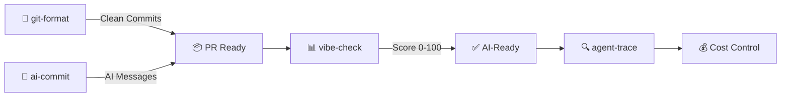

[English](README.md) | [中文](README.zh.md) | [日本語](README.ja.md) | [Français](README.fr.md) | [Español](README.es.md) | [العربية](README.ar.md) | [한국어](README.ko.md) | [Português](README.pt.md) | [Русский](README.ru.md) | [Deutsch](README.de.md)

<!-- ═══════════════════════════════════════════════════════════════ -->
<!-- HEADER: Animated Terminal                                       -->
<!-- ═══════════════════════════════════════════════════════════════ -->

<div align="center">


</div>


<br/>

<!-- ═══════════════════════════════════════════════════════════════ -->
<!-- BADGES: npm downloads + profile stats                           -->
<!-- ═══════════════════════════════════════════════════════════════ -->

<a href="https://www.npmjs.com/package/git-format"></a>
<a href="https://www.npmjs.com/package/ai-commit"></a>
<a href="https://www.npmjs.com/package/agent-trace"></a>
<a href="https://www.npmjs.com/package/vibe-check"></a>

<br/>

<a href="https://github.com/liangzhengtao"></a>

<a href="https://github.com/liangzhengtao?tab=repositories"></a>

</div>

---

<!-- ═══════════════════════════════════════════════════════════════ -->
<!-- ABOUT ME                                                        -->
<!-- ═══════════════════════════════════════════════════════════════ -->

## 👋 Обо мне

Я разработчик, специализирующийся на создании CLI-инструментов на основе ИИ. Мои инструменты помогают разработчикам в:
- **Git-воркфлоу** — автоформатирование коммитов, сообщения, сгенерированные ИИ
- **Мониторинг ИИ-агентов** — отслеживание стоимости, токонов, состояния инструментов
- **Аудит проектов** — оценка готовности кодовой базы к использованию ИИ

Все инструменты с открытым исходным кодом, лицензированы MIT и запускаются через `npx` — без установки.

---

<!-- ═══════════════════════════════════════════════════════════════ -->
<!-- QUICK TRY: Terminal Demo                                        -->
<!-- ═══════════════════════════════════════════════════════════════ -->

## ⚡ Попробуйте за 10 секунд

```bash
# Format messy git history → clean Conventional Commits
npx git-format

# AI writes your commit messages
npx ai-commit

# Score your project's AI-readiness (0-100)
npx @liangzhengtao/vibe-check

# Track your AI agent — costs, tokens, tool calls
npx agent-trace
```

**Без клонирования · Без API-ключа · Без настройки · Просто запустите**

---

<!-- ═══════════════════════════════════════════════════════════════ -->
<!-- WHAT I BUILD                                                    -->
<!-- ═══════════════════════════════════════════════════════════════ -->

## 🔧 Что я создаю

### Оригинальные CLI-инструменты

| Инструмент | Что делает | Попробовать |
|:-----------|:-----------|:------------|
| **[git-format](https://github.com/liangzhengtao/git-format)** | Форматирование коммитов в Conventional Commits | `npx git-format` |
| **[ai-commit](https://github.com/liangzhengtao/ai-commit)** | ИИ генерирует сообщения коммитов из git diff | `npx ai-commit` |
| **[agent-trace](https://github.com/liangzhengtao/agent-trace)** | Отслеживание стоимости, токенов, состояния инструментов ИИ-агента | `npx agent-trace` |
| **[vibe-check](https://github.com/liangzhengtao/vibe-check)** | Аудит готовности проекта к ИИ (оценка 0-100) | `npx @liangzhengtao/vibe-check` |

### Тематические коллекции

| Коллекция | Содержание |
|:----------|:-----------|
| **[awesome-ai-rules](https://github.com/liangzhengtao/awesome-ai-rules)** | 20 правил ИИ-программирования для продакшена для Cursor, Claude, Kimi Code |
| **[awesome-mcp-servers](https://github.com/liangzhengtao/awesome-mcp-servers)** | 9 проверенных конфигураций MCP-серверов |
| **[awesome-prompts](https://github.com/liangzhengtao/awesome-prompts)** | 285+ проверенных ИИ-промптов для любых задач |

---

<!-- ═══════════════════════════════════════════════════════════════ -->
<!-- TECH STACK: Animated Skill Icons                                -->
<!-- ═══════════════════════════════════════════════════════════════ -->

## 📊 Технологический стек

<div align="center">

<a href="https://skillicons.dev">

</a>

</div>

---

<!-- ═══════════════════════════════════════════════════════════════ -->
<!-- WORKFLOW: Mermaid Diagram                                        -->
<!-- ═══════════════════════════════════════════════════════════════ -->

## 🔀 Как работают мои инструменты



---

<!-- ═══════════════════════════════════════════════════════════════ -->
<!-- GITHUB STATS: Animated Cards                                    -->
<!-- ═══════════════════════════════════════════════════════════════ -->

## 📈 Статистика GitHub

<div align="center">


<br/>


</div>

---

<!-- ═══════════════════════════════════════════════════════════════ -->
<!-- ACTIVITY GRAPH                                                  -->
<!-- ═══════════════════════════════════════════════════════════════ -->

## 🔥 Активность

<div align="center">


</div>

---

<!-- ═══════════════════════════════════════════════════════════════ -->
<!-- ALL PROJECTS                                                    -->
<!-- ═══════════════════════════════════════════════════════════════ -->

## 📂 Все проекты (60+)

<details>
<summary><b>🤖 Инструменты ИИ-разработки (6)</b></summary>

| Проект | Описание |
|:-------|:---------|
| [agent-trace](https://github.com/liangzhengtao/agent-trace) | Отслеживание ИИ-агента — стоимость, токены, состояние инструментов |
| [awesome-ai-rules](https://github.com/liangzhengtao/awesome-ai-rules) | 20 правил ИИ-программирования для продакшена |
| [vibe-check](https://github.com/liangzhengtao/vibe-check) | Оценка готовности проекта к ИИ (0-100) |
| [commit-ai](https://github.com/liangzhengtao/ai-commit) | ИИ пишет сообщения коммитов |
| [awesome-mcp-servers](https://github.com/liangzhengtao/awesome-mcp-servers) | 9 проверенных MCP-серверов |
| [awesome-ai-agents](https://github.com/liangzhengtao/awesome-ai-agents) | 12 навыков ИИ-агентов для продакшена |

</details>

<details>
<summary><b>📚 Исследования и карьера (7)</b></summary>

| Проект | Описание |
|:-------|:---------|
| [awesome-skills](https://github.com/liangzhengtao/awesome-skills) | 12 исследовательских навыков (LaTeX, статистика) |
| [awesome-research-figures](https://github.com/liangzhengtao/awesome-research-figures) | Научные иллюстрации публикационного качества |
| [awesome-interview-skills](https://github.com/liangzhengtao/awesome-interview-skills) | 14 навыков для получения работы мечты |
| [system-design-interview](https://github.com/liangzhengtao/system-design-interview) | Подготовка к системному проектированию с ASCII-диаграммами |
| [awesome-developer-roadmap](https://github.com/liangzhengtao/awesome-developer-roadmap) | 10 карьерных дорожных карт (джуниор → стафф) |
| [build-your-own-x-cn](https://github.com/liangzhengtao/build-your-own-x-cn) | Создание технологий с нуля (10 руководств) |
| [leetcode-patterns-cn](https://github.com/liangzhengtao/leetcode-patterns-cn) | 8 алгоритмических паттернов, 72 задачи |

</details>

<details>
<summary><b>🎬 Видео и творчество (7)</b></summary>

| Проект | Описание |
|:-------|:---------|
| [awesome-video-prompts](https://github.com/liangzhengtao/awesome-video-prompts) | 200+ промптов (Sora, Runway, Kling) |
| [awesome-video-to-text](https://github.com/liangzhengtao/awesome-video-to-text) | 12 навыков транскрибирования |
| [awesome-video-creation](https://github.com/liangzhengtao/awesome-video-creation) | 14 навыков видеопроизводства |
| [awesome-video-skills](https://github.com/liangzhengtao/awesome-video-skills) | 10 навыков видеомонтажа |
| [awesome-creative-skills](https://github.com/liangzhengtao/awesome-creative-skills) | 10 творческих навыков (постеры, логотипы) |
| [awesome-writing-skills](https://github.com/liangzhengtao/awesome-writing-skills) | 12 навыков письма (блог, SEO) |
| [awesome-prompts](https://github.com/liangzhengtao/awesome-prompts) | 285+ ИИ-промптов для любых задач |

</details>

<details>
<summary><b>🛠️ Ресурсы для разработчиков (8)</b></summary>

| Проект | Описание |
|:-------|:---------|
| [awesome-dev-tools](https://github.com/liangzhengtao/awesome-dev-tools) | 50+ инструментов разработчика по категориям |
| [awesome-devops-skills](https://github.com/liangzhengtao/awesome-devops-skills) | 12 навыков DevOps (CI/CD, K8s) |
| [awesome-security-skills](https://github.com/liangzhengtao/awesome-security-skills) | 12 навыков кибербезопасности |
| [awesome-startup-skills](https://github.com/liangzhengtao/awesome-startup-skills) | 12 навыков для основателей стартапов |
| [ai-agent-architectures](https://github.com/liangzhengtao/ai-agent-architectures) | 7 архитектурных паттернов ИИ-агентов |
| [open-source-llm-guide](https://github.com/liangzhengtao/open-source-llm-guide) | Запуск LLM на собственном оборудовании |
| [github-stars-analysis](https://github.com/liangzhengtao/github-stars-analysis) | Анализ трендов звёзд GitHub |
| [awesome-chinese-developer-tools](https://github.com/liangzhengtao/awesome-chinese-developer-tools) | Инструменты китайских разработчиков |

</details>

<details>
<summary><b>📁 Личное (4)</b></summary>

| Проект | Описание |
|:-------|:---------|
| [my-dotfiles](https://github.com/liangzhengtao/my-dotfiles) | Окружение разработчика (Zsh, Git, Neovim) |
| [guizhou-exam-papers](https://github.com/liangzhengtao/guizhou-exam-papers) | Экзаменационные работы Гуйчжоу (бесплатно для студентов) |
| [blog](https://github.com/liangzhengtao/blog) | Технические статьи в блоге |
| [git-format](https://github.com/liangzhengtao/git-format) | Форматирование коммитов в Conventional Commits |

</details>

---

<!-- ═══════════════════════════════════════════════════════════════ -->
<!-- FOOTER                                                          -->
<!-- ═══════════════════════════════════════════════════════════════ -->

<div align="center">

### 🤝 Связаться

[](https://github.com/liangzhengtao)
[](https://github.com/liangzhengtao/blog)

**60+ проектов · Всё с открытым кодом · Всё бесплатно**

*Если что-то из этого сэкономило вам время, ⭐ репозиторий, который вы использовали больше всего.*

</div>
