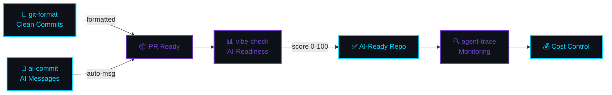

[English](README.md) | [中文](README.zh.md) | [日本語](README.ja.md) | [Français](README.fr.md) | [Español](README.es.md) | [العربية](README.ar.md) | [한국어](README.ko.md) | [Português](README.pt.md) | [Русский](README.ru.md) | [Deutsch](README.de.md)

<!-- ═══════════════════════════════════════════════════════════════════════════════ -->
<!-- ██  HEADER: Deep Space Terminal  ██ -->
<!-- ═══════════════════════════════════════════════════════════════════════════════ -->


<div align="center">

<!-- Terminal-style name -->
```
 ███████╗██╗  ██╗███████╗███╗   ██╗ ██████╗ ████████╗ █████╗  ██████╗ 
 ╚══██╔╝██║  ██║██╔════╝████╗  ██║██╔═══██╗╚══██╔══╝██╔══██╗██╔═══██╗
    ██║ ███████║█████╗  ██╔██╗ ██║██║   ██║   ██║   ███████║██║   ██║
    ██║ ██╔══██║██╔══╝  ██║╚██╗██║██║   ██║   ██║   ██╔══██║██║   ██║
    ██║ ██║  ██║███████╗██║ ╚████║╚██████╔╝   ██║   ██║  ██║╚██████╔╝
    ╚═╝ ╚═╝  ╚═╝╚══════╝╚═╝  ╚═══╝ ╚═════╝    ╚═╝   ╚═╝  ╚═╝ ╚═════╝
```

<!-- Animated typing effect -->


<br/>

<!-- Badges row 1: npm downloads -->
<a href="https://www.npmjs.com/package/git-format"></a>
<a href="https://www.npmjs.com/package/ai-commit"></a>
<a href="https://www.npmjs.com/package/agent-trace"></a>
<a href="https://www.npmjs.com/package/vibe-check"></a>

<!-- Badges row 2: profile stats -->
<a href="https://github.com/liangzhengtao"></a>

<a href="https://github.com/liangzhengtao?tab=repositories"></a>

</div>

---

<!-- ═══════════════════════════════════════════════════════════════════════════════ -->
<!-- ██  QUICK TRY: Terminal Demo  ██ -->
<!-- ═══════════════════════════════════════════════════════════════════════════════ -->

<div align="center">

```
┌──────────────────────────────────────────────────────────────────────┐
│  $ npx git-format                                                    │
│  ✓ feat(auth): add login validation                                  │
│                                                                      │
│  $ npx ai-commit                                                     │
│  ✓ fix(api): handle null response in user endpoint                   │
│                                                                      │
│  $ npx @liangzhengtao/vibe-check                                     │
│  ┌────────────────────────────────────────────────────────────────┐  │
│  │ ✨ Score: 83/100 │ Grade: A                                    │  │
│  │ Great! Your project is very AI-friendly.                       │  │
│  └────────────────────────────────────────────────────────────────┘  │
│                                                                      │
│  $ npx agent-trace                                                   │
│  📊 Sessions: 64 │ Cost: $4681 │ Tokens: 2.3B                       │
│                                                                      │
│  Без клонирования · Без API-ключа · Без настройки · Просто запустите │
└──────────────────────────────────────────────────────────────────────┘
```

</div>

---

<!-- ═══════════════════════════════════════════════════════════════════════════════ -->
<!-- ██  WHAT I BUILD  ██ -->
<!-- ═══════════════════════════════════════════════════════════════════════════════ -->

<div align="center">

### `>_` ЧТО Я СОЗДАЮ

</div>

<table>
<tr>
<td width="50%" valign="top">

#### 🔧 Оригинальные CLI-инструменты

| Инструмент | Команда |
|:-----------|:--------|
| **[git-format](https://github.com/liangzhengtao/git-format)** — Conventional Commits | `npx git-format` |
| **[ai-commit](https://github.com/liangzhengtao/ai-commit)** — AI-коммиты с сообщениями | `npx ai-commit` |
| **[agent-trace](https://github.com/liangzhengtao/agent-trace)** — Мониторинг агентов | `npx agent-trace` |
| **[vibe-check](https://github.com/liangzhengtao/vibe-check)** — Аудит AI-готовности | `npx @liangzhengtao/vibe-check` |

</td>
<td width="50%" valign="top">

#### 📦 Избранные коллекции

| Коллекция | Основное |
|:----------|:---------|
| **[awesome-ai-rules](https://github.com/liangzhengtao/awesome-ai-rules)** | 20 производственных правил AI-кодинга |
| **[awesome-mcp-servers](https://github.com/liangzhengtao/awesome-mcp-servers)** | 9 проверенных MCP-конфигураций |
| **[awesome-prompts](https://github.com/liangzhengtao/awesome-prompts)** | 285+ AI-промптов |

</td>
</tr>
</table>

---

<!-- ═══════════════════════════════════════════════════════════════════════════════ -->
<!-- ██  ANALYTICS  ██ -->
<!-- ═══════════════════════════════════════════════════════════════════════════════ -->

<div align="center">

### `>_` АНАЛИТИКА


<br/>


</div>

---

<!-- ═══════════════════════════════════════════════════════════════════════════════ -->
<!-- ██  TECH STACK  ██ -->
<!-- ═══════════════════════════════════════════════════════════════════════════════ -->

<div align="center">

### `>_` ТЕХНОЛОГИЧЕСКИЙ СТЕК

<!-- Languages -->


<!-- AI/ML -->


<!-- Frontend -->


<!-- Backend -->


<!-- DevOps -->


<!-- Tools -->


</div>

---

<!-- ═══════════════════════════════════════════════════════════════════════════════ -->
<!-- ██  WORKFLOW  ██ -->
<!-- ═══════════════════════════════════════════════════════════════════════════════ -->

<div align="center">

### `>_` РАБОЧИЙ ПРОЦЕСС

</div>



---

<!-- ═══════════════════════════════════════════════════════════════════════════════ -->
<!-- ██  ALL PROJECTS  ██ -->
<!-- ═══════════════════════════════════════════════════════════════════════════════ -->

<div align="center">

### `>_` ВСЕ ПРОЕКТЫ `33`

</div>

<details>
<summary><b> Инструменты разработчика AI (6)</b></summary>
<br>

| Проект | Описание |
|:-------|:---------|
| [agent-trace](https://github.com/liangzhengtao/agent-trace) | Отслеживание AI-агента — затраты, токены, здоровье инструментов |
| [awesome-ai-rules](https://github.com/liangzhengtao/awesome-ai-rules) | 20 производственных правил AI-кодинга |
| [vibe-check](https://github.com/liangzhengtao/vibe-check) | Оценка AI-готовности проекта (0-100) |
| [commit-ai](https://github.com/liangzhengtao/ai-commit) | AI пишет сообщения коммитов |
| [awesome-mcp-servers](https://github.com/liangzhengtao/awesome-mcp-servers) | 9 проверенных MCP-серверов |
| [awesome-ai-agents](https://github.com/liangzhengtao/awesome-ai-agents) | 12 навыков AI-агентов для продакшена |

</details>

<details>
<summary><b> Исследования и карьера (7)</b></summary>
<br>

| Проект | Описание |
|:-------|:---------|
| [awesome-skills](https://github.com/liangzhengtao/awesome-skills) | 12 исследовательских навыков (LaTeX, статистика) |
| [awesome-research-figures](https://github.com/liangzhengtao/awesome-research-figures) | Научные иллюстрации публикационного качества |
| [awesome-interview-skills](https://github.com/liangzhengtao/awesome-interview-skills) | 14 навыков для получения работы мечты |
| [system-design-interview](https://github.com/liangzhengtao/system-design-interview) | Подготовка к системному проектированию с ASCII-диаграммами |
| [awesome-developer-roadmap](https://github.com/liangzhengtao/awesome-developer-roadmap) | 10 карьерных дорожных карт (junior → staff) |
| [build-your-own-x-cn](https://github.com/liangzhengtao/build-your-own-x-cn) | Создание технологий с нуля (10 руководств) |
| [leetcode-patterns-cn](https://github.com/liangzhengtao/leetcode-patterns-cn) | 8 алгоритмических паттернов, 72 задачи |

</details>

<details>
<summary><b> Видео и творчество (7)</b></summary>
<br>

| Проект | Описание |
|:-------|:---------|
| [awesome-video-prompts](https://github.com/liangzhengtao/awesome-video-prompts) | 200+ промптов (Sora, Runway, Kling) |
| [awesome-video-to-text](https://github.com/liangzhengtao/awesome-video-to-text) | 12 навыков транскрипции |
| [awesome-video-creation](https://github.com/liangzhengtao/awesome-video-creation) | 14 навыков видеорабочего процесса |
| [awesome-video-skills](https://github.com/liangzhengtao/awesome-video-skills) | 10 навыков видеомонтажа |
| [awesome-creative-skills](https://github.com/liangzhengtao/awesome-creative-skills) | 10 творческих навыков (постеры, логотипы) |
| [awesome-writing-skills](https://github.com/liangzhengtao/awesome-writing-skills) | 12 навыков написания (блог, SEO) |
| [awesome-prompts](https://github.com/liangzhengtao/awesome-prompts) | 285+ AI-промптов для любой задачи |

</details>

<details>
<summary><b> Ресурсы разработчика (8)</b></summary>
<br>

| Проект | Описание |
|:-------|:---------|
| [awesome-dev-tools](https://github.com/liangzhengtao/awesome-dev-tools) | 50+ инструментов разработчика по категориям |
| [awesome-devops-skills](https://github.com/liangzhengtao/awesome-devops-skills) | 12 навыков DevOps (CI/CD, K8s) |
| [awesome-security-skills](https://github.com/liangzhengtao/awesome-security-skills) | 12 навыков кибербезопасности |
| [awesome-startup-skills](https://github.com/liangzhengtao/awesome-startup-skills) | 12 навыков для основателей |
| [ai-agent-architectures](https://github.com/liangzhengtao/ai-agent-architectures) | 7 паттернов AI-агентов |
| [open-source-llm-guide](https://github.com/liangzhengtao/open-source-llm-guide) | Запуск LLM на собственном оборудовании |
| [github-stars-analysis](https://github.com/liangzhengtao/github-stars-analysis) | Анализ трендов GitHub-звёзд |
| [awesome-chinese-developer-tools](https://github.com/liangzhengtao/awesome-chinese-developer-tools) | Инструменты китайских разработчиков |

</details>

<details>
<summary><b> Личное (4)</b></summary>
<br>

| Проект | Описание |
|:-------|:---------|
| [my-dotfiles](https://github.com/liangzhengtao/my-dotfiles) | Среда разработки (Zsh, Git, Neovim) |
| [guizhou-exam-papers](https://github.com/liangzhengtao/guizhou-exam-papers) | Экзаменационные работы Гуйчжоу (бесплатно для студентов) |
| [blog](https://github.com/liangzhengtao/blog) | Технические статьи в блоге |
| [git-format](https://github.com/liangzhengtao/git-format) | Форматирование коммитов в Conventional Commits |

</details>

---

<!-- ═══════════════════════════════════════════════════════════════════════════════ -->
<!-- ██  FOOTER  ██ -->
<!-- ═══════════════════════════════════════════════════════════════════════════════ -->

<div align="center">

### `>_` КОНТАКТЫ

[](https://github.com/liangzhengtao)
[](https://github.com/liangzhengtao/blog)

<br/>

**33 проекта · Всё с открытым исходным кодом · Всё бесплатно**

*Если что-то из этого сэкономило ваше время, ⭐ репозиторий, который вы использовали чаще всего.*

<br/>


</div>