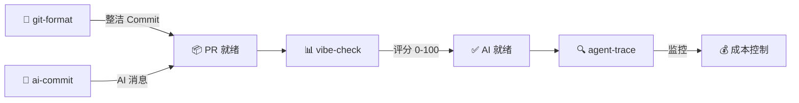

[English](README.md) | [中文](README.zh.md) | [日本語](README.ja.md) | [Français](README.fr.md) | [Español](README.es.md) | [العربية](README.ar.md) | [한국어](README.ko.md) | [Português](README.pt.md) | [Русский](README.ru.md) | [Deutsch](README.de.md)

<div align="center">


### `>_` 构建自动化 AI 开发繁琐环节的 CLI 工具

[](https://www.npmjs.com/package/git-format)
[](https://www.npmjs.com/package/ai-commit)
[](https://www.npmjs.com/package/agent-trace)
[](https://github.com/liangzhengtao)

</div>

---

##  10 秒试一个

```bash
# 🎯 杂乱 Git 历史 → 整洁的 Conventional Commits
npx git-format

# 🤖 AI 根据暂存变更生成 commit message
npx ai-commit

# 📊 给项目打 AI 友好度分（0-100）
npx @liangzhengtao/vibe-check

# 🔍 追踪 AI Agent — 成本、Token、工具调用
npx agent-trace
```

<p align="center">
  <b>无需克隆 · 无需 API Key · 无需配置 · 直接运行</b>
</p>

---

##  我做什么

<table>
<tr>
<td width="50%">

### 🔧 原创 CLI 工具

| 工具 | 试用 |
|:-----|:-----|
| **[git-format](https://github.com/liangzhengtao/git-format)** — Conventional Commits | `npx git-format` |
| **[ai-commit](https://github.com/liangzhengtao/ai-commit)** — AI commit message | `npx ai-commit` |
| **[agent-trace](https://github.com/liangzhengtao/agent-trace)** — Agent 监控 | `npx agent-trace` |
| **[vibe-check](https://github.com/liangzhengtao/vibe-check)** — AI 准备度审计 | `npx @liangzhengtao/vibe-check` |

</td>
<td width="50%">

### 📦 精选合集

| 合集 | 亮点 |
|:-----|:-----|
| **[awesome-ai-rules](https://github.com/liangzhengtao/awesome-ai-rules)** | 20 条生产级 AI 编程规则 |
| **[awesome-mcp-servers](https://github.com/liangzhengtao/awesome-mcp-servers)** | 9 个验证过的 MCP 配置 |
| **[awesome-prompts](https://github.com/liangzhengtao/awesome-prompts)** | 285+ AI 提示词 |

</td>
</tr>
</table>

---

##  GitHub 数据

<div align="center">


</div>

---

##  技术栈

<div align="center">


</div>

---

##  工作流



---

##  全部 33 个项目

<details>
<summary><strong>🤖 AI 开发工具（6 个）</strong></summary>
<br>

| 项目 | 功能 |
|:-----|:-----|
| [agent-trace](https://github.com/liangzhengtao/agent-trace) | 🔍 追踪 AI Agent — 成本、Token、工具健康 |
| [awesome-ai-rules](https://github.com/liangzhengtao/awesome-ai-rules) | 📏 20 条生产级 AI 编程规则 |
| [vibe-check](https://github.com/liangzhengtao/vibe-check) | 📊 项目 AI 友好度评分（0-100） |
| [commit-ai](https://github.com/liangzhengtao/ai-commit) | 🤖 AI 写 commit message |
| [awesome-mcp-servers](https://github.com/liangzhengtao/awesome-mcp-servers) | 🔌 9 个验证过的 MCP 服务器 |
| [awesome-ai-agents](https://github.com/liangzhengtao/awesome-ai-agents) | 🏗️ 12 个生产级 AI Agent 技能 |

</details>

<details>
<summary><strong>📚 科研与求职（7 个）</strong></summary>
<br>

| 项目 | 功能 |
|:-----|:-----|
| [awesome-skills](https://github.com/liangzhengtao/awesome-skills) | 🔬 12 个科研技能 |
| [awesome-research-figures](https://github.com/liangzhengtao/awesome-research-figures) | 📈 出版级科研绘图 |
| [awesome-interview-skills](https://github.com/liangzhengtao/awesome-interview-skills) | 💼 14 个面试技能 |
| [system-design-interview](https://github.com/liangzhengtao/system-design-interview) | 🏛️ 系统设计面试指南 |
| [awesome-developer-roadmap](https://github.com/liangzhengtao/awesome-developer-roadmap) | 🗺️ 10 个职业路线图 |
| [build-your-own-x-cn](https://github.com/liangzhengtao/build-your-own-x-cn) | 🛠️ 从零构建技术（10 个教程） |
| [leetcode-patterns-cn](https://github.com/liangzhengtao/leetcode-patterns-cn) | 🧩 8 种算法模式，72 道题 |

</details>

<details>
<summary><strong>🎬 视频与创意（7 个）</strong></summary>
<br>

| 项目 | 功能 |
|:-----|:-----|
| [awesome-video-prompts](https://github.com/liangzhengtao/awesome-video-prompts) | 🎥 200+ 视频生成 prompt |
| [awesome-video-to-text](https://github.com/liangzhengtao/awesome-video-to-text) | 📝 12 个转录技能 |
| [awesome-video-creation](https://github.com/liangzhengtao/awesome-video-creation) | 🎬 14 个视频制作技能 |
| [awesome-video-skills](https://github.com/liangzhengtao/awesome-video-skills) | ✂️ 10 个视频剪辑技能 |
| [awesome-creative-skills](https://github.com/liangzhengtao/awesome-creative-skills) | 🎨 10 个创意技能 |
| [awesome-writing-skills](https://github.com/liangzhengtao/awesome-writing-skills) | ✍️ 12 个写作技能 |
| [awesome-prompts](https://github.com/liangzhengtao/awesome-prompts) | 💡 285+ AI 提示词 |

</details>

<details>
<summary><strong>🛠️ 开发者资源（8 个）</strong></summary>
<br>

| 项目 | 功能 |
|:-----|:-----|
| [awesome-dev-tools](https://github.com/liangzhengtao/awesome-dev-tools) | 🧰 50+ 开发者工具 |
| [awesome-devops-skills](https://github.com/liangzhengtao/awesome-devops-skills) | 🚀 12 个 DevOps 技能 |
| [awesome-security-skills](https://github.com/liangzhengtao/awesome-security-skills) | 🔒 12 个安全技能 |
| [awesome-startup-skills](https://github.com/liangzhengtao/awesome-startup-skills) | 🚀 12 个创业技能 |
| [ai-agent-architectures](https://github.com/liangzhengtao/ai-agent-architectures) | 🏗️ 7 种 AI Agent 架构 |
| [open-source-llm-guide](https://github.com/liangzhengtao/open-source-llm-guide) | 🧠 本地部署 LLM |
| [github-stars-analysis](https://github.com/liangzhengtao/github-stars-analysis) | ⭐ GitHub Star 趋势分析 |
| [awesome-chinese-developer-tools](https://github.com/liangzhengtao/awesome-chinese-developer-tools) | 🇨🇳 中文开发者工具 |

</details>

<details>
<summary><strong>📁 个人项目（4 个）</strong></summary>
<br>

| 项目 | 功能 |
|:-----|:-----|
| [my-dotfiles](https://github.com/liangzhengtao/my-dotfiles) | ⚙️ 开发环境配置 |
| [guizhou-exam-papers](https://github.com/liangzhengtao/guizhou-exam-papers) | 📖 贵州高考真题 |
| [blog](https://github.com/liangzhengtao/blog) | 📝 技术博客 |
| [git-format](https://github.com/liangzhengtao/git-format) | 🔧 格式化 Git Commit |

</details>

---

<div align="center">

### 🤝 联系

[](https://github.com/liangzhengtao)
[](https://github.com/liangzhengtao/blog)

### 💝 支持

如果对你有帮助，给你最常用的仓库点个 ⭐

<br>


</div>
