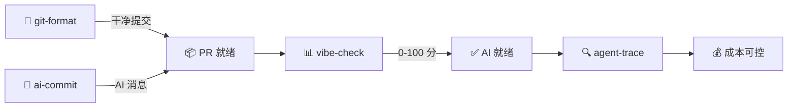

[English](README.md) | [中文](README.zh.md)

<div align="center">


</div>


<!-- BADGES: npm downloads + profile stats -->

<a href="https://www.npmjs.com/package/git-format"></a>
<a href="https://www.npmjs.com/package/ai-commit"></a>
<a href="https://www.npmjs.com/package/agent-trace"></a>
<a href="https://www.npmjs.com/package/vibe-check"></a>

<br/>

<a href="https://github.com/Serennity007"></a>

<a href="https://github.com/Serennity007?tab=repositories"></a>

---

<!-- ABOUT -->

## 👋 关于我

AI 研究者 & 开源开发者，**北京理工大学**智能科学与技术硕士在读（2026 级）。一作论文投中 **CCF-BigData 2025**（大语言模型法律判决预测方向）。

- 🔧 **4 个 npm CLI 工具** — `npx` 直接运行，零安装
- 📦 **324 个开源仓库** — 全部 MIT，全部免费
- 🏆 华为 ICT 大赛**国家一等奖**（+ 全球三等奖）· 国家奖学金 · 专业排名 **1/69**，GPA **4.14/5**
- 🔬 法律 AI + 多模态安全对齐 · 🇸🇬 新国立交换 · 雅思 6.5

---

<!-- QUICK TRY -->

## ⚡ 10 秒上手

```bash
# 把混乱的 git 历史格式化为 Conventional Commits
npx git-format

# AI 帮你写 commit message
npx ai-commit

# 给项目的 AI 友好度打分（0-100）
npx @liangzhengtao/vibe-check

# 追踪你的 AI Agent —— 成本、token、工具调用
npx agent-trace
```

**不 clone · 不要 API key · 不用配置 · 直接跑**

---

<!-- WHAT I BUILD -->

## 🔧 我做了什么

| 工具 | 功能 | 试试 |
|:-----|:-----|:-----|
| **[git-format](https://github.com/Serennity007/git-format)** | 提交格式化为 Conventional Commits | `npx git-format` |
| **[ai-commit](https://github.com/Serennity007/ai-commit)** | AI 根据 git diff 生成提交信息 | `npx ai-commit` |
| **[agent-trace](https://github.com/Serennity007/agent-trace)** | 追踪 AI Agent 成本、token、工具健康 | `npx agent-trace` |
| **[vibe-check](https://github.com/Serennity007/vibe-check)** | 评估项目 AI 就绪度（0-100 分） | `npx @liangzhengtao/vibe-check` |

### 精选合集

| 合集 | 内容 |
|:-----|:-----|
| **[awesome-ai-rules](https://github.com/Serennity007/awesome-ai-rules)** | 20 条生产级 AI 编码规则（Cursor / Claude / Kimi Code） |
| **[awesome-mcp-servers](https://github.com/Serennity007/awesome-mcp-servers)** | 9 个验证过的 MCP 服务器配置 |
| **[awesome-prompts](https://github.com/Serennity007/awesome-prompts)** | 285+ 实测 AI 提示词 |

---

<!-- TECH STACK -->

## 📊 技术栈

<div align="center">

<a href="https://skillicons.dev">

</a>

</div>

---

<!-- WORKFLOW -->

## 🔀 工具如何协同



---

<!-- GITHUB STATS -->

## 📈 GitHub 统计

<div align="center">


<br/>


</div>

---

<!-- ACTIVITY -->

## 🐍 活跃度

<div align="center">

<picture>
  <source media="(prefers-color-scheme: dark)" srcset="https://cdn.jsdelivr.net/gh/Serennity007/Serennity007@output/github-contribution-grid-snake-dark.svg" />
  <source media="(prefers-color-scheme: light)" srcset="https://cdn.jsdelivr.net/gh/Serennity007/Serennity007@output/github-contribution-grid-snake.svg" />
  
</picture>

</div>

---

<!-- FEATURED PROJECTS -->

<details>
<summary><b>📂 精选项目（324 选 10）</b></summary>

| 项目 | 说明 |
|:-----|:-----|
| [token-meter](https://github.com/Serennity007/token-meter) | AI 编程 Agent 的实时 token / 成本计量器 |
| [paper-grill](https://github.com/Serennity007/paper-grill) | 论文毒舌审稿 — NeurIPS / ICML / ICLR 风格 |
| [awesome-ai-alignment](https://github.com/Serennity007/awesome-ai-alignment) | 12 个 AI 安全与对齐技能 |
| [awesome-trading-strategies](https://github.com/Serennity007/awesome-trading-strategies) | 散户可用的 6 大交易策略合集 |
| [awesome-stock-quant-skills](https://github.com/Serennity007/awesome-stock-quant-skills) | 量化研究 & 交易技能合集 |
| [awesome-research-figures](https://github.com/Serennity007/awesome-research-figures) | 出版级科研图表绘制技能 |
| [awesome-ai-agents](https://github.com/Serennity007/awesome-ai-agents) | 12 个生产级 AI Agent 技能 |
| [awesome-geo](https://github.com/Serennity007/awesome-geo) | 让 AI 搜索引擎推荐你（GEO 指南） |
| [awesome-portfolio-skills](https://github.com/Serennity007/awesome-portfolio-skills) | 打造亮眼的开发者作品集 |
| [build-your-own-x](https://github.com/Serennity007/build-your-own-x) | 从零构建技术 — 精选教程 |

**[查看全部 324 个仓库 →](https://github.com/Serennity007?tab=repositories)**

</details>

---

<!-- CONNECT -->

<div align="center">

### 🤝 联系我

[](https://github.com/Serennity007)
[](mailto:1392452425a@gmail.com)
[](https://serennity007.github.io/liangzhengtao-portfolio/)
[](https://github.com/Serennity007/blog)

**324 个仓库 · 全部开源 · 全部免费**

*如果某个项目帮到了你，给那个仓库一个 ⭐*

</div>
