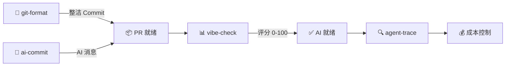

[English](README.md) | [中文](README.zh.md) | [日本語](README.ja.md) | [Français](README.fr.md) | [Español](README.es.md) | [العربية](README.ar.md) | [한국어](README.ko.md) | [Português](README.pt.md) | [Русский](README.ru.md) | [Deutsch](README.de.md)

<!-- ═══════════════════════════════════════════════════════════════ -->
<!-- HEADER: 动态打字效果                                             -->
<!-- ═══════════════════════════════════════════════════════════════ -->

<div align="center">


<br/>

<a href="https://www.npmjs.com/package/git-format"></a>
<a href="https://www.npmjs.com/package/ai-commit"></a>
<a href="https://www.npmjs.com/package/agent-trace"></a>
<a href="https://www.npmjs.com/package/vibe-check"></a>

<br/>

<a href="https://github.com/liangzhengtao"></a>

<a href="https://github.com/liangzhengtao?tab=repositories"></a>

</div>

---

## 👋 关于我

我是一名专注于构建 AI 驱动 CLI 工具的开发者。我的工具帮助开发者：
- **Git 工作流** — 自动格式化 commit、AI 生成消息
- **AI Agent 监控** — 追踪成本、Token、工具健康
- **项目审计** — 评估代码库的 AI 准备度

所有工具都是开源的，MIT 协议，可以通过 `npx` 直接运行——零安装。

---

## ⚡ 10 秒试一个

```bash
# 杂乱 Git 历史 → 整洁的 Conventional Commits
npx git-format

# AI 写 commit message
npx ai-commit

# 给项目打 AI 友好度分（0-100）
npx @liangzhengtao/vibe-check

# 追踪 AI Agent — 成本、Token、工具调用
npx agent-trace
```

**无需克隆 · 无需 API Key · 无需配置 · 直接运行**

---

## 🔧 我做什么

### 原创 CLI 工具

| 工具 | 功能 | 试用 |
|:-----|:-----|:-----|
| **[git-format](https://github.com/liangzhengtao/git-format)** | 格式化 commit 为 Conventional Commits | `npx git-format` |
| **[ai-commit](https://github.com/liangzhengtao/ai-commit)** | AI 从 git diff 生成 commit message | `npx ai-commit` |
| **[agent-trace](https://github.com/liangzhengtao/agent-trace)** | 追踪 AI Agent 成本、Token、工具健康 | `npx agent-trace` |
| **[vibe-check](https://github.com/liangzhengtao/vibe-check)** | 审计项目 AI 准备度（0-100 分） | `npx @liangzhengtao/vibe-check` |

### 精选合集

| 合集 | 内容 |
|:-----|:-----|
| **[awesome-ai-rules](https://github.com/liangzhengtao/awesome-ai-rules)** | 20 条生产级 AI 编程规则（Cursor、Claude、Kimi Code） |
| **[awesome-mcp-servers](https://github.com/liangzhengtao/awesome-mcp-servers)** | 9 个验证过的 MCP 服务器配置 |
| **[awesome-prompts](https://github.com/liangzhengtao/awesome-prompts)** | 285+ 经过测试的 AI 提示词 |

---

## 📊 技术栈

<div align="center">

<a href="https://skillicons.dev">

</a>

</div>

---

## 🔀 工具协作流程



---

## 📈 GitHub 数据

<div align="center">


<br/>


</div>

---

## 🔥 活跃度

<div align="center">


</div>

---

## 📂 全部项目（60+）

<details>
<summary><b>🤖 AI 开发工具（6 个）</b></summary>

| 项目 | 功能 |
|:-----|:-----|
| [agent-trace](https://github.com/liangzhengtao/agent-trace) | 追踪 AI Agent — 成本、Token、工具健康 |
| [awesome-ai-rules](https://github.com/liangzhengtao/awesome-ai-rules) | 20 条生产级 AI 编程规则 |
| [vibe-check](https://github.com/liangzhengtao/vibe-check) | 项目 AI 友好度评分（0-100） |
| [commit-ai](https://github.com/liangzhengtao/ai-commit) | AI 写 commit message |
| [awesome-mcp-servers](https://github.com/liangzhengtao/awesome-mcp-servers) | 9 个验证过的 MCP 服务器 |
| [awesome-ai-agents](https://github.com/liangzhengtao/awesome-ai-agents) | 12 个生产级 AI Agent 技能 |

</details>

<details>
<summary><b>📚 科研与求职（7 个）</b></summary>

| 项目 | 功能 |
|:-----|:-----|
| [awesome-skills](https://github.com/liangzhengtao/awesome-skills) | 12 个科研技能 |
| [awesome-research-figures](https://github.com/liangzhengtao/awesome-research-figures) | 出版级科研绘图 |
| [awesome-interview-skills](https://github.com/liangzhengtao/awesome-interview-skills) | 14 个面试技能 |
| [system-design-interview](https://github.com/liangzhengtao/system-design-interview) | 系统设计面试指南 |
| [awesome-developer-roadmap](https://github.com/liangzhengtao/awesome-developer-roadmap) | 10 个职业路线图 |
| [build-your-own-x-cn](https://github.com/liangzhengtao/build-your-own-x-cn) | 从零构建技术（10 个教程） |
| [leetcode-patterns-cn](https://github.com/liangzhengtao/leetcode-patterns-cn) | 8 种算法模式，72 道题 |

</details>

<details>
<summary><b>🎬 视频与创意（7 个）</b></summary>

| 项目 | 功能 |
|:-----|:-----|
| [awesome-video-prompts](https://github.com/liangzhengtao/awesome-video-prompts) | 200+ 视频生成 prompt |
| [awesome-video-to-text](https://github.com/liangzhengtao/awesome-video-to-text) | 12 个转录技能 |
| [awesome-video-creation](https://github.com/liangzhengtao/awesome-video-creation) | 14 个视频制作技能 |
| [awesome-video-skills](https://github.com/liangzhengtao/awesome-video-skills) | 10 个视频剪辑技能 |
| [awesome-creative-skills](https://github.com/liangzhengtao/awesome-creative-skills) | 10 个创意技能 |
| [awesome-writing-skills](https://github.com/liangzhengtao/awesome-writing-skills) | 12 个写作技能 |
| [awesome-prompts](https://github.com/liangzhengtao/awesome-prompts) | 285+ AI 提示词 |

</details>

<details>
<summary><b>🛠️ 开发者资源（8 个）</b></summary>

| 项目 | 功能 |
|:-----|:-----|
| [awesome-dev-tools](https://github.com/liangzhengtao/awesome-dev-tools) | 50+ 开发者工具 |
| [awesome-devops-skills](https://github.com/liangzhengtao/awesome-devops-skills) | 12 个 DevOps 技能 |
| [awesome-security-skills](https://github.com/liangzhengtao/awesome-security-skills) | 12 个安全技能 |
| [awesome-startup-skills](https://github.com/liangzhengtao/awesome-startup-skills) | 12 个创业技能 |
| [ai-agent-architectures](https://github.com/liangzhengtao/ai-agent-architectures) | 7 种 AI Agent 架构 |
| [open-source-llm-guide](https://github.com/liangzhengtao/open-source-llm-guide) | 本地部署 LLM |
| [github-stars-analysis](https://github.com/liangzhengtao/github-stars-analysis) | GitHub Star 趋势分析 |
| [awesome-chinese-developer-tools](https://github.com/liangzhengtao/awesome-chinese-developer-tools) | 中文开发者工具 |

</details>

<details>
<summary><b>📁 个人项目（4 个）</b></summary>

| 项目 | 功能 |
|:-----|:-----|
| [my-dotfiles](https://github.com/liangzhengtao/my-dotfiles) | 开发环境配置 |
| [guizhou-exam-papers](https://github.com/liangzhengtao/guizhou-exam-papers) | 贵州高考真题 |
| [blog](https://github.com/liangzhengtao/blog) | 技术博客 |
| [git-format](https://github.com/liangzhengtao/git-format) | 格式化 Git Commit |

</details>

---

<div align="center">

### 🤝 联系

[](https://github.com/liangzhengtao)
[](https://github.com/liangzhengtao/blog)

**60+ 个项目 · 全部开源 · 全部免费**

*如果对你有帮助，给你最常用的仓库点个 ⭐*

</div>
